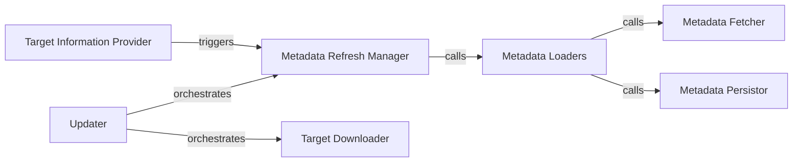

## Details

Analysis of the Client Updater Subsystem within the TUF framework.

### Updater [[Expand]](./Updater.md)
The primary interface and orchestrator for the client-side update process. It initializes the update environment and coordinates the overall flow.

**Related Classes/Methods**:

- <a href="https://github.com/theupdateframework/python-tuf/blob/develop/tuf/ngclient/updater.py#L77-L563" target="_blank" rel="noopener noreferrer">`tuf.ngclient.updater.Updater`:77-563</a>

### Metadata Refresh Manager
Drives the entire metadata refresh cycle, ensuring the client possesses the latest trusted root, timestamp, snapshot, and targets metadata. This is crucial for maintaining the integrity and freshness of the update process, preventing rollback attacks.

**Related Classes/Methods**:

- <a href="https://github.com/theupdateframework/python-tuf/blob/develop/tuf/ngclient/updater.py#L145-L172" target="_blank" rel="noopener noreferrer">`tuf.ngclient.updater.refresh`:145-172</a>

### Target Downloader
Handles the secure download of specific target files identified during the update process. It ensures the authenticity and integrity of the downloaded files through cryptographic verification.

**Related Classes/Methods**:

- <a href="https://github.com/theupdateframework/python-tuf/blob/develop/tuf/ngclient/updater.py#L242-L302" target="_blank" rel="noopener noreferrer">`tuf.ngclient.updater.download_target`:242-302</a>

### Metadata Loaders
A set of specialized components responsible for loading, verifying, and processing different types of metadata (root, timestamp, snapshot, targets). They form the core of the cryptographic verification pipeline, ensuring the trustworthiness of the update chain.

**Related Classes/Methods**:

- <a href="https://github.com/theupdateframework/python-tuf/blob/develop/tuf/ngclient/updater.py#L369-L413" target="_blank" rel="noopener noreferrer">`tuf.ngclient.updater._load_root`:369-413</a>
- <a href="https://github.com/theupdateframework/python-tuf/blob/develop/tuf/ngclient/updater.py#L415-L435" target="_blank" rel="noopener noreferrer">`tuf.ngclient.updater._load_timestamp`:415-435</a>
- <a href="https://github.com/theupdateframework/python-tuf/blob/develop/tuf/ngclient/updater.py#L437-L455" target="_blank" rel="noopener noreferrer">`tuf.ngclient.updater._load_snapshot`:437-455</a>
- <a href="https://github.com/theupdateframework/python-tuf/blob/develop/tuf/ngclient/updater.py#L457-L493" target="_blank" rel="noopener noreferrer">`tuf.ngclient.updater._load_targets`:457-493</a>

### Metadata Fetcher [[Expand]](./Metadata_Fetcher.md)
Provides a common mechanism for securely fetching metadata files from the remote repository. It abstracts network communication and handles potential errors during data retrieval.

**Related Classes/Methods**:

- <a href="https://github.com/theupdateframework/python-tuf/blob/develop/tuf/ngclient/updater.py#L304-L313" target="_blank" rel="noopener noreferrer">`tuf.ngclient.updater._download_metadata`:304-313</a>

### Metadata Persistor
Manages the secure storage of verified metadata files to the client's local cache. This component is vital for maintaining a consistent and trusted local state, especially for the root metadata which establishes the initial trust anchor.

**Related Classes/Methods**:

- <a href="https://github.com/theupdateframework/python-tuf/blob/develop/tuf/ngclient/updater.py#L320-L329" target="_blank" rel="noopener noreferrer">`tuf.ngclient.updater._persist_metadata`:320-329</a>
- <a href="https://github.com/theupdateframework/python-tuf/blob/develop/tuf/ngclient/updater.py#L331-L339" target="_blank" rel="noopener noreferrer">`tuf.ngclient.updater._persist_root`:331-339</a>

### Target Information Provider
Allows external components or the client application to query information about available targets. It can trigger a metadata refresh if the current target information is deemed stale, ensuring up-to-date and secure target data.

**Related Classes/Methods**:

- <a href="https://github.com/theupdateframework/python-tuf/blob/develop/tuf/ngclient/updater.py#L182-L210" target="_blank" rel="noopener noreferrer">`tuf.ngclient.updater.get_targetinfo`:182-210</a>

### [FAQ](https://github.com/CodeBoarding/GeneratedOnBoardings/tree/main?tab=readme-ov-file#faq)