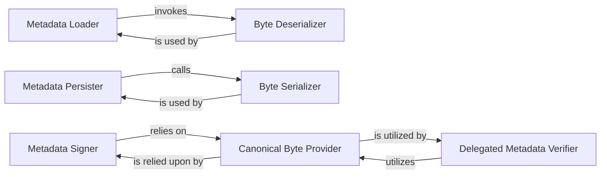

## Details

The `Metadata API` subsystem is a core component of the TUF security framework, primarily responsible for managing the lifecycle and cryptographic integrity of TUF metadata objects.

### Metadata Loader
Provides a high-level interface for reading and deserializing TUF metadata from a specified file path. It abstracts the underlying byte-level deserialization process, making it easier for higher-level components to consume metadata.

**Related Classes/Methods**:

- <a href="https://github.com/theupdateframework/python-tuf/blob/develop/tuf/api/metadata.py" target="_blank" rel="noopener noreferrer">`Metadata Loader`</a>

### Metadata Persister
Offers a high-level interface for serializing TUF metadata objects into a canonical byte stream and writing them to a specified file path. It abstracts the low-level byte serialization, ensuring consistent storage.

**Related Classes/Methods**:

- <a href="https://github.com/theupdateframework/python-tuf/blob/develop/tuf/api/metadata.py" target="_blank" rel="noopener noreferrer">`Metadata Persister`</a>

### Metadata Signer
Responsible for applying cryptographic signatures to a TUF metadata object. This component is crucial for establishing the authenticity and integrity of metadata, a fundamental security requirement in TUF.

**Related Classes/Methods**:

- <a href="https://github.com/theupdateframework/python-tuf/blob/develop/tuf/api/metadata.py" target="_blank" rel="noopener noreferrer">`Metadata Signer`</a>

### Delegated Metadata Verifier
Focuses on verifying the integrity and authenticity of delegated TUF metadata, including the validation of cryptographic signatures. This is a critical security function for establishing and maintaining trust in the delegated roles.

**Related Classes/Methods**:

- <a href="https://github.com/theupdateframework/python-tuf/blob/develop/tuf/api/metadata.py" target="_blank" rel="noopener noreferrer">`Delegated Metadata Verifier`</a>

### Byte Deserializer
A lower-level utility that converts raw byte streams into structured TUF metadata objects. It handles the format-specific parsing required before metadata can be used by the system.

**Related Classes/Methods**:

- <a href="https://github.com/theupdateframework/python-tuf/blob/develop/tuf/api/metadata.py" target="_blank" rel="noopener noreferrer">`Byte Deserializer`</a>

### Byte Serializer
A lower-level utility that converts a structured TUF metadata object into a canonical byte stream. This is essential for ensuring that metadata is consistently represented for cryptographic operations like signing and hashing.

**Related Classes/Methods**:

- <a href="https://github.com/theupdateframework/python-tuf/blob/develop/tuf/api/metadata.py" target="_blank" rel="noopener noreferrer">`Byte Serializer`</a>

### Canonical Byte Provider
Ensures that a consistent, canonical byte representation of metadata is available for cryptographic operations. This is vital for reproducible signing and verification, preventing malleability attacks.

**Related Classes/Methods**:

- <a href="https://github.com/theupdateframework/python-tuf/blob/develop/tuf/api/metadata.py" target="_blank" rel="noopener noreferrer">`Canonical Byte Provider`</a>

### [FAQ](https://github.com/CodeBoarding/GeneratedOnBoardings/tree/main?tab=readme-ov-file#faq)