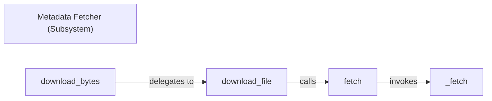

## Details

The `Metadata Fetcher` subsystem is a critical part of the `tuf` client, responsible for securely and reliably retrieving metadata and target files from a repository. It embodies a layered approach to network communication and file handling, aligning with the project's "Layered Architecture" and "Client-Server" patterns.

### Metadata Fetcher (Subsystem)
The overarching component responsible for securely and reliably retrieving data from the repository. It acts as the logical container for all fetching-related operations.

**Related Classes/Methods**:

- <a href="https://github.com/theupdateframework/python-tuf/blob/develop/tuf/ngclient/fetcher.py" target="_blank" rel="noopener noreferrer">`tuf.ngclient.fetcher`</a>

### fetch
Serves as the primary entry point for initiating core fetching operations. It abstracts underlying network communication details, providing a standardized interface for higher-level download logic. This component is key to the "Layered Architecture" by allowing different network backends to be integrated without impacting the overall system.

**Related Classes/Methods**:

- <a href="https://github.com/theupdateframework/python-tuf/blob/develop/tuf/ngclient/fetcher.py#L53-L73" target="_blank" rel="noopener noreferrer">`tuf.ngclient.fetcher.fetch`:53-73</a>

### _fetch
Handles the low-level network communication, directly interacting with HTTP libraries to perform the actual data retrieval. It encapsulates network-specific logic, isolating network interactions and potential vulnerabilities.

**Related Classes/Methods**:

- <a href="https://github.com/theupdateframework/python-tuf/blob/develop/tuf/ngclient/fetcher.py#L31-L51" target="_blank" rel="noopener noreferrer">`tuf.ngclient.fetcher._fetch`:31-51</a>

### download_file
Manages the process of downloading an entire file, including handling file system interactions (e.g., writing to a temporary location or specified path). It orchestrates the file download, ensuring data is correctly handled and stored before cryptographic verification.

**Related Classes/Methods**:

- <a href="https://github.com/theupdateframework/python-tuf/blob/develop/tuf/ngclient/fetcher.py#L75-L119" target="_blank" rel="noopener noreferrer">`tuf.ngclient.fetcher.download_file`:75-119</a>

### download_bytes
Provides the highest-level interface for consumers to download file content as raw bytes. It abstracts the underlying fetching mechanism, offering a direct interface for applications needing raw file data without immediate file system persistence.

**Related Classes/Methods**:

- <a href="https://github.com/theupdateframework/python-tuf/blob/develop/tuf/ngclient/fetcher.py#L121-L140" target="_blank" rel="noopener noreferrer">`tuf.ngclient.fetcher.download_bytes`:121-140</a>

### [FAQ](https://github.com/CodeBoarding/GeneratedOnBoardings/tree/main?tab=readme-ov-file#faq)