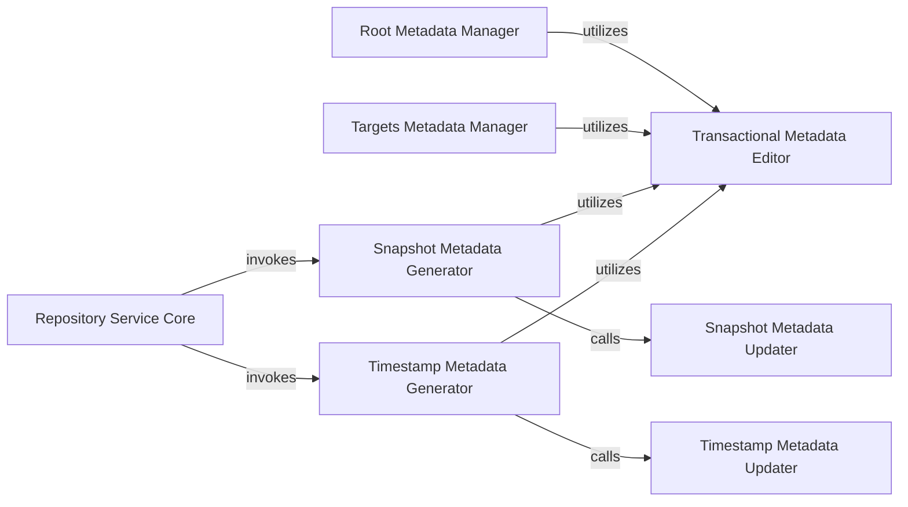

## Details

The `tuf.repository` subsystem is centered around the `Repository Service Core`, which acts as the primary orchestrator for managing the TUF repository's state and metadata operations. This core service invokes specialized generators like the `Snapshot Metadata Generator` and `Timestamp Metadata Generator` to produce critical metadata files. All metadata modifications, including those managed by the `Root Metadata Manager` and `Targets Metadata Manager`, are handled within a consistent transactional context provided by the `Transactional Metadata Editor`. This editor is crucial for ensuring atomicity and consistency, as it orchestrates the loading of the current repository state and the persistence of all changes as a single, atomic operation. Furthermore, the `Snapshot Metadata Updater` and `Timestamp Metadata Updater` are called by their respective generators to apply granular changes within this transactional framework, ensuring the integrity and freshness of the repository's metadata.

### Repository Service Core
The central orchestrator of the TUF repository's server-side operations. It manages the overall state, coordinates metadata generation, signing, and acts as the primary interface for repository management.

**Related Classes/Methods**:

- <a href="https://github.com/theupdateframework/python-tuf/blob/develop/tuf/repository/_repository.py#L35-L277" target="_blank" rel="noopener noreferrer">`tuf.repository._repository.Repository`:35-277</a>

### Snapshot Metadata Generator
Responsible for generating and signing the snapshot.json metadata, which provides a consistent, immutable view of all current target files and delegated roles. It ensures data consistency across the repository.

**Related Classes/Methods**:

- <a href="https://github.com/theupdateframework/python-tuf/blob/develop/tuf/repository/_repository.py#L174-L234" target="_blank" rel="noopener noreferrer">`tuf.repository._repository.do_snapshot`:174-234</a>

### Timestamp Metadata Generator
Generates and signs the timestamp.json metadata, which protects against rollback attacks by referencing the latest snapshot.json. It ensures freshness and prevents clients from accepting outdated metadata.

**Related Classes/Methods**:

- <a href="https://github.com/theupdateframework/python-tuf/blob/develop/tuf/repository/_repository.py#L236-L277" target="_blank" rel="noopener noreferrer">`tuf.repository._repository.do_timestamp`:236-277</a>

### Root Metadata Manager
Manages modifications to the root.json metadata, which defines the trusted keys and roles of the repository. This component is critical for establishing and maintaining the chain of trust.

**Related Classes/Methods**:

- <a href="https://github.com/theupdateframework/python-tuf/blob/develop/tuf/repository/_repository.py#L112-L118" target="_blank" rel="noopener noreferrer">`tuf.repository._repository.edit_root`:112-118</a>

### Targets Metadata Manager
Manages modifications to the targets.json metadata, which lists the actual software artifacts, their cryptographic hashes, and file paths. It ensures the integrity and authenticity of the distributed software.

**Related Classes/Methods**:

- <a href="https://github.com/theupdateframework/python-tuf/blob/develop/tuf/repository/_repository.py#L136-L144" target="_blank" rel="noopener noreferrer">`tuf.repository._repository.edit_targets`:136-144</a>

### Transactional Metadata Editor
Provides a transactional context for all repository metadata modifications, ensuring atomicity and consistency. It orchestrates the loading of the current repository state and the persistence of all changes as a single, atomic operation.

**Related Classes/Methods**:

- <a href="https://github.com/theupdateframework/python-tuf/blob/develop/tuf/repository/_repository.py#L95-L110" target="_blank" rel="noopener noreferrer">`tuf.repository._repository.edit`:95-110</a>

### Snapshot Metadata Updater
Applies specific, granular changes to the snapshot.json metadata within a transactional context. This component is typically invoked by the Snapshot Metadata Generator.

**Related Classes/Methods**:

- <a href="https://github.com/theupdateframework/python-tuf/blob/develop/tuf/repository/_repository.py#L128-L134" target="_blank" rel="noopener noreferrer">`tuf.repository._repository.edit_snapshot`:128-134</a>

### Timestamp Metadata Updater
Applies specific, granular changes to the timestamp.json metadata within a transactional context. This component is typically invoked by the Timestamp Metadata Generator.

**Related Classes/Methods**:

- <a href="https://github.com/theupdateframework/python-tuf/blob/develop/tuf/repository/_repository.py#L120-L126" target="_blank" rel="noopener noreferrer">`tuf.repository._repository.edit_timestamp`:120-126</a>

### [FAQ](https://github.com/CodeBoarding/GeneratedOnBoardings/tree/main?tab=readme-ov-file#faq)