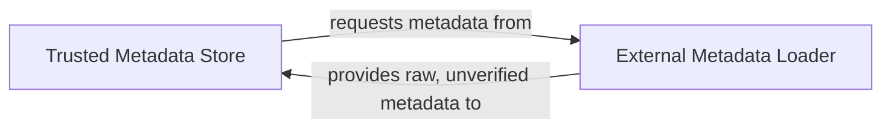

## Details

The TUF client subsystem is primarily composed of two core components: the `Trusted Metadata Store` and the `External Metadata Loader`. The `External Metadata Loader` is responsible for the initial retrieval of raw, unverified TUF metadata from external sources, acting as the data ingress point for the system. This raw metadata is then passed to the `Trusted Metadata Store`. The `Trusted Metadata Store` is the central component, tasked with cryptographically verifying, storing, and managing all trusted TUF metadata (root, timestamp, snapshot, and targets). It ensures the integrity and authenticity of the metadata through a series of update and verification processes.

### Trusted Metadata Store [[Expand]](./Trusted_Metadata_Store.md)
Manages the client's cryptographically verified TUF metadata, acting as the authoritative repository for root, timestamp, snapshot, and targets metadata. It orchestrates secure updates, performs cryptographic verification, enforces consistency, and serves as the foundational trust anchor for TUF interactions. This component is critical for maintaining the integrity and trustworthiness of the TUF metadata.

**Related Classes/Methods**:

- <a href="https://github.com/theupdateframework/python-tuf/blob/develop/tuf/ngclient/_internal/trusted_metadata_set.py#L94-L454" target="_blank" rel="noopener noreferrer">`tuf.ngclient._internal.trusted_metadata_set.TrustedMetadataSet`:94-454</a>
- <a href="https://github.com/theupdateframework/python-tuf/blob/develop/tuf/ngclient/_internal/trusted_metadata_set.py#L166-L202" target="_blank" rel="noopener noreferrer">`tuf.ngclient._internal.trusted_metadata_set.update_root`:166-202</a>
- <a href="https://github.com/theupdateframework/python-tuf/blob/develop/tuf/ngclient/_internal/trusted_metadata_set.py#L204-L268" target="_blank" rel="noopener noreferrer">`tuf.ngclient._internal.trusted_metadata_set.update_timestamp`:204-268</a>
- <a href="https://github.com/theupdateframework/python-tuf/blob/develop/tuf/ngclient/_internal/trusted_metadata_set.py#L270-L274" target="_blank" rel="noopener noreferrer">`tuf.ngclient._internal.trusted_metadata_set._check_final_timestamp`:270-274</a>
- <a href="https://github.com/theupdateframework/python-tuf/blob/develop/tuf/ngclient/_internal/trusted_metadata_set.py#L276-L355" target="_blank" rel="noopener noreferrer">`tuf.ngclient._internal.trusted_metadata_set.update_snapshot`:276-355</a>
- <a href="https://github.com/theupdateframework/python-tuf/blob/develop/tuf/ngclient/_internal/trusted_metadata_set.py#L357-L367" target="_blank" rel="noopener noreferrer">`tuf.ngclient._internal.trusted_metadata_set._check_final_snapshot`:357-367</a>
- <a href="https://github.com/theupdateframework/python-tuf/blob/develop/tuf/ngclient/_internal/trusted_metadata_set.py#L369-L382" target="_blank" rel="noopener noreferrer">`tuf.ngclient._internal.trusted_metadata_set.update_targets`:369-382</a>
- <a href="https://github.com/theupdateframework/python-tuf/blob/develop/tuf/ngclient/_internal/trusted_metadata_set.py#L384-L440" target="_blank" rel="noopener noreferrer">`tuf.ngclient._internal.trusted_metadata_set.update_delegated_targets`:384-440</a>

### External Metadata Loader
A mechanism responsible for fetching raw, unverified TUF metadata from an external source (e.g., a remote repository). It acts as the initial data provider, supplying the `Trusted Metadata Store` with metadata that then undergoes cryptographic verification and processing.

**Related Classes/Methods**:

- <a href="https://github.com/theupdateframework/python-tuf/blob/develop/tuf/ngclient/_internal/proxy.py#L17-L101" target="_blank" rel="noopener noreferrer">`tuf.ngclient._internal.proxy.ProxyEnvironment`:17-101</a>
- <a href="https://github.com/theupdateframework/python-tuf/blob/develop/tuf/ngclient/_internal/proxy.py#L90-L101" target="_blank" rel="noopener noreferrer">`tuf.ngclient._internal.proxy.ProxyEnvironment.request`:90-101</a>

### [FAQ](https://github.com/CodeBoarding/GeneratedOnBoardings/tree/main?tab=readme-ov-file#faq)