```mermaid
graph LR
    Client_Updater["Client Updater"]
    Metadata_Fetcher["Metadata Fetcher"]
    Trusted_Metadata_Store["Trusted Metadata Store"]
    Repository_Service["Repository Service"]
    Metadata_API["Metadata API"]
    Serialization_Layer["Serialization Layer"]
    Payload_Verification["Payload Verification"]
    Client_Updater -- "requests metadata/targets from" --> Metadata_Fetcher
    Client_Updater -- "updates/queries trusted state in" --> Trusted_Metadata_Store
    Metadata_Fetcher -- "fetches files from" --> Repository_Service
    Repository_Service -- "serves files to" --> Metadata_Fetcher
    Trusted_Metadata_Store -- "uses for metadata object manipulation" --> Metadata_API
    Metadata_API -- "uses for serialization/deserialization" --> Serialization_Layer
    Metadata_API -- "delegates payload verification to" --> Payload_Verification
    Repository_Service -- "generates and signs metadata using" --> Metadata_API
    Repository_Service -- "calculates hashes for targets using" --> Payload_Verification
    click Client_Updater href "https://github.com/CodeBoarding/GeneratedOnBoardings/blob/main/python-tuf/Client_Updater.md" "Details"
    click Metadata_Fetcher href "https://github.com/CodeBoarding/GeneratedOnBoardings/blob/main/python-tuf/Metadata_Fetcher.md" "Details"
    click Trusted_Metadata_Store href "https://github.com/CodeBoarding/GeneratedOnBoardings/blob/main/python-tuf/Trusted_Metadata_Store.md" "Details"
    click Repository_Service href "https://github.com/CodeBoarding/GeneratedOnBoardings/blob/main/python-tuf/Repository_Service.md" "Details"
    click Metadata_API href "https://github.com/CodeBoarding/GeneratedOnBoardings/blob/main/python-tuf/Metadata_API.md" "Details"
```

## Details

The `python-tuf` architecture is fundamentally a client-server system designed for secure software updates. The `Client Updater` acts as the orchestrator on the client side, initiating the update process by requesting metadata and target files. These requests are fulfilled by the `Metadata Fetcher`, which communicates with the remote `Repository Service`. Upon receiving data, the `Client Updater` passes it to the `Trusted Metadata Store` for rigorous cryptographic validation and storage. Both the client-side validation (via `Trusted Metadata Store`) and server-side metadata generation (`Repository Service`) heavily rely on the `Metadata API` for abstract metadata object manipulation. This `Metadata API` in turn leverages the `Serialization Layer` for data format handling and the `Payload Verification` component for all critical cryptographic integrity checks. This layered and modular design ensures a robust and verifiable supply chain for software distribution.

### Client Updater [[Expand]](./Client_Updater.md)
Orchestrates the client-side update process, managing metadata and target file downloads.

**Related Classes/Methods**:

- <a href="https://github.com/theupdateframework/python-tuf/blob/develop/tuf/ngclient/updater.py#L145-L172" target="_blank" rel="noopener noreferrer">`tuf.ngclient.updater.refresh`:145-172</a>
- <a href="https://github.com/theupdateframework/python-tuf/blob/develop/tuf/ngclient/updater.py#L242-L302" target="_blank" rel="noopener noreferrer">`tuf.ngclient.updater.download_target`:242-302</a>

### Metadata Fetcher [[Expand]](./Metadata_Fetcher.md)
Handles network communication for fetching metadata and target files from the repository.

**Related Classes/Methods**:

- <a href="https://github.com/theupdateframework/python-tuf/blob/develop/tuf/ngclient/fetcher.py#L53-L73" target="_blank" rel="noopener noreferrer">`tuf.ngclient.fetcher.fetch`:53-73</a>

### Trusted Metadata Store [[Expand]](./Trusted_Metadata_Store.md)
Manages the client's cryptographically verified TUF metadata, ensuring integrity.

**Related Classes/Methods**:

- <a href="https://github.com/theupdateframework/python-tuf/blob/develop/tuf/ngclient/_internal/trusted_metadata_set.py#L166-L202" target="_blank" rel="noopener noreferrer">`tuf.ngclient._internal.trusted_metadata_set.update_root`:166-202</a>
- <a href="https://github.com/theupdateframework/python-tuf/blob/develop/tuf/ngclient/_internal/trusted_metadata_set.py#L204-L268" target="_blank" rel="noopener noreferrer">`tuf.ngclient._internal.trusted_metadata_set.update_timestamp`:204-268</a>
- <a href="https://github.com/theupdateframework/python-tuf/blob/develop/tuf/ngclient/_internal/trusted_metadata_set.py#L276-L355" target="_blank" rel="noopener noreferrer">`tuf.ngclient._internal.trusted_metadata_set.update_snapshot`:276-355</a>
- <a href="https://github.com/theupdateframework/python-tuf/blob/develop/tuf/ngclient/_internal/trusted_metadata_set.py#L369-L382" target="_blank" rel="noopener noreferrer">`tuf.ngclient._internal.trusted_metadata_set.update_targets`:369-382</a>

### Repository Service [[Expand]](./Repository_Service.md)
Manages server-side operations for a TUF repository, including metadata generation and serving.

**Related Classes/Methods**:

- <a href="https://github.com/theupdateframework/python-tuf/blob/develop/tuf/repository/_repository.py#L174-L234" target="_blank" rel="noopener noreferrer">`tuf.repository._repository.do_snapshot`:174-234</a>
- <a href="https://github.com/theupdateframework/python-tuf/blob/develop/tuf/repository/_repository.py#L236-L277" target="_blank" rel="noopener noreferrer">`tuf.repository._repository.do_timestamp`:236-277</a>
- <a href="https://github.com/theupdateframework/python-tuf/blob/develop/tuf/repository/_repository.py#L112-L118" target="_blank" rel="noopener noreferrer">`tuf.repository._repository.edit_root`:112-118</a>
- <a href="https://github.com/theupdateframework/python-tuf/blob/develop/tuf/repository/_repository.py#L136-L144" target="_blank" rel="noopener noreferrer">`tuf.repository._repository.edit_targets`:136-144</a>

### Metadata API [[Expand]](./Metadata_API.md)
Provides an abstract interface for interacting with TUF metadata objects (loading, saving, signing, verifying).

**Related Classes/Methods**:

- <a href="https://github.com/theupdateframework/python-tuf/blob/develop/tuf/api/metadata.py#L211-L242" target="_blank" rel="noopener noreferrer">`tuf.api.metadata.from_file`:211-242</a>
- <a href="https://github.com/theupdateframework/python-tuf/blob/develop/tuf/api/metadata.py#L311-L346" target="_blank" rel="noopener noreferrer">`tuf.api.metadata.to_file`:311-346</a>
- <a href="https://github.com/theupdateframework/python-tuf/blob/develop/tuf/api/metadata.py#L349-L391" target="_blank" rel="noopener noreferrer">`tuf.api.metadata.sign`:349-391</a>
- <a href="https://github.com/theupdateframework/python-tuf/blob/develop/tuf/api/metadata.py#L393-L418" target="_blank" rel="noopener noreferrer">`tuf.api.metadata.verify_delegate`:393-418</a>

### Serialization Layer
Handles conversion of TUF metadata objects to and from serialization formats (e.g., JSON).

**Related Classes/Methods**:

- <a href="https://github.com/theupdateframework/python-tuf/blob/develop/tuf/api/serialization/json.py#L93-L107" target="_blank" rel="noopener noreferrer">`tuf.api.serialization.json.serialize`:93-107</a>
- <a href="https://github.com/theupdateframework/python-tuf/blob/develop/tuf/api/serialization/json.py#L33-L42" target="_blank" rel="noopener noreferrer">`tuf.api.serialization.json.deserialize`:33-42</a>

### Payload Verification
Encapsulates cryptographic hashing, length verification, and integrity checks for data payloads.

**Related Classes/Methods**:

- <a href="https://github.com/theupdateframework/python-tuf/blob/develop/tuf/api/_payload.py#L1665-L1676" target="_blank" rel="noopener noreferrer">`tuf.api._payload.verify_length_and_hashes`:1665-1676</a>
- <a href="https://github.com/theupdateframework/python-tuf/blob/develop/tuf/api/_payload.py#L433-L477" target="_blank" rel="noopener noreferrer">`tuf.api._payload.get_verification_result`:433-477</a>

### [FAQ](https://github.com/CodeBoarding/GeneratedOnBoardings/tree/main?tab=readme-ov-file#faq)