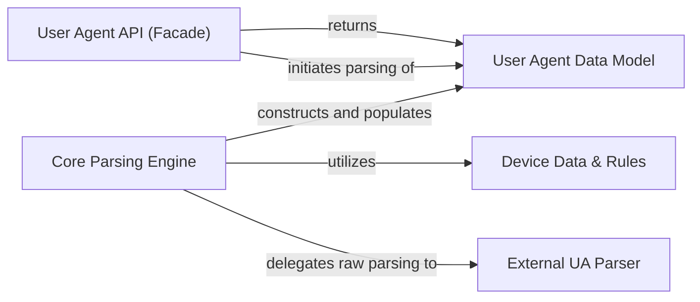

## Details

The `python-user-agents` library provides a streamlined interface for parsing user agent strings. The `User Agent API (Facade)` serves as the primary entry point, simplifying complex parsing operations. It delegates the core parsing logic to the `Core Parsing Engine`, which in turn leverages an `External UA Parser` for initial low-level parsing and `Device Data & Rules` for enriched device identification. The parsed information is then structured and exposed through the `User Agent Data Model`, offering a comprehensive representation of the user agent and methods for querying device capabilities. This modular design ensures clear separation of concerns, making the system maintainable and extensible.

### User Agent API (Facade)
The primary public interface for the library, simplifying the user agent parsing process.

**Related Classes/Methods**:

- <a href="https://github.com/selwin/python-user-agents/blob/master/user_agents/parsers.py#L279-L280" target="_blank" rel="noopener noreferrer">`user_agents.parsers.parse`:279-280</a>

### Core Parsing Engine
Encapsulates the internal logic for breaking down user agent strings and coordinating with external data sources.

**Related Classes/Methods**:

- <a href="https://github.com/selwin/python-user-agents/blob/master/user_agents/parsers.py#L117-L121" target="_blank" rel="noopener noreferrer">`user_agents.parsers.parse_browser`:117-121</a>
- <a href="https://github.com/selwin/python-user-agents/blob/master/user_agents/parsers.py#L127-L130" target="_blank" rel="noopener noreferrer">`user_agents.parsers.parse_operating_system`:127-130</a>
- <a href="https://github.com/selwin/python-user-agents/blob/master/user_agents/parsers.py#L136-L137" target="_blank" rel="noopener noreferrer">`user_agents.parsers.parse_device`:136-137</a>

### User Agent Data Model
Represents the structured output of the parsing process, holding all extracted information and providing methods for querying device capabilities.

**Related Classes/Methods**:

- <a href="https://github.com/selwin/python-user-agents/blob/master/user_agents/parsers.py#L140-L276" target="_blank" rel="noopener noreferrer">`user_agents.parsers.UserAgent`:140-276</a>

### Device Data & Rules
Static configuration and data files that provide additional rules and information for accurate device detection.

**Related Classes/Methods**: _None_

### External UA Parser
A third-party library (ua-parser) responsible for the low-level, rule-based parsing of user agent strings into a raw dictionary format.

**Related Classes/Methods**:

- <a href="https://github.com/selwin/python-user-agents/blob/master/user_agents/parsers.py" target="_blank" rel="noopener noreferrer">`ua_parser.user_agent_parser.Parse`</a>

### [FAQ](https://github.com/CodeBoarding/GeneratedOnBoardings/tree/main?tab=readme-ov-file#faq)