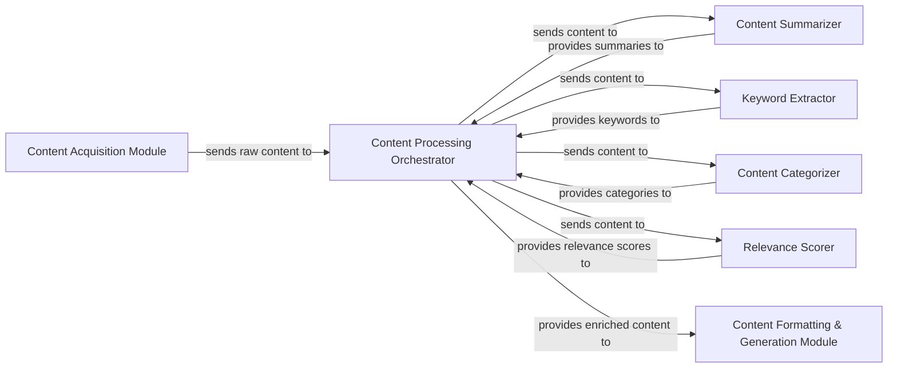

## Details

Abstract Components Overview

### Content Processing Orchestrator
This central component manages the entire content processing workflow within the module. It receives raw content, dispatches it to specialized NLP/AI sub-components for various analyses, aggregates their outputs, and compiles the final enriched content. It acts as the primary interface for the module.

**Related Classes/Methods**:

- `split_and_generate_files`
- `read_md`
- `parse_md`
- `write_summary_content`
- `write_to_md_file`
- `write_to_md_file_en`

### Content Summarizer
This component is dedicated to generating concise and coherent summaries of the input content using advanced NLP models.

**Related Classes/Methods**:

- `resources/weekly_summary_en.py`

### Keyword Extractor
Responsible for identifying and extracting the most significant keywords and key phrases from the content, aiding in content indexing and searchability.

**Related Classes/Methods**:

- <a href="https://github.com/chinesehuazhou/python-weekly/blob/main/resources/weekly_wordcloud.py" target="_blank" rel="noopener noreferrer">`resources/weekly_wordcloud.py`</a>

### Content Categorizer
Classifies the processed content into predefined categories or topics, enabling structured organization, filtering, and improved content discoverability.

**Related Classes/Methods**: _None_

### Relevance Scorer
Evaluates and assigns a relevance score to the content, potentially based on predefined criteria, user preferences, or contextual factors, to prioritize or highlight important articles.

**Related Classes/Methods**: _None_

### Content Acquisition Module [[Expand]](./Content_Acquisition_Module.md)
Responsible for ingesting raw content from various sources.

**Related Classes/Methods**:

- `read_md`
- `get_front_matter`

### Content Formatting & Generation Module
Responsible for formatting the processed and enriched content into final output formats.

**Related Classes/Methods**:

- `content_to_string`
- `write_summary_content`
- `write_to_md_file`
- `write_to_md_file_en`

### [FAQ](https://github.com/CodeBoarding/GeneratedOnBoardings/tree/main?tab=readme-ov-file#faq)