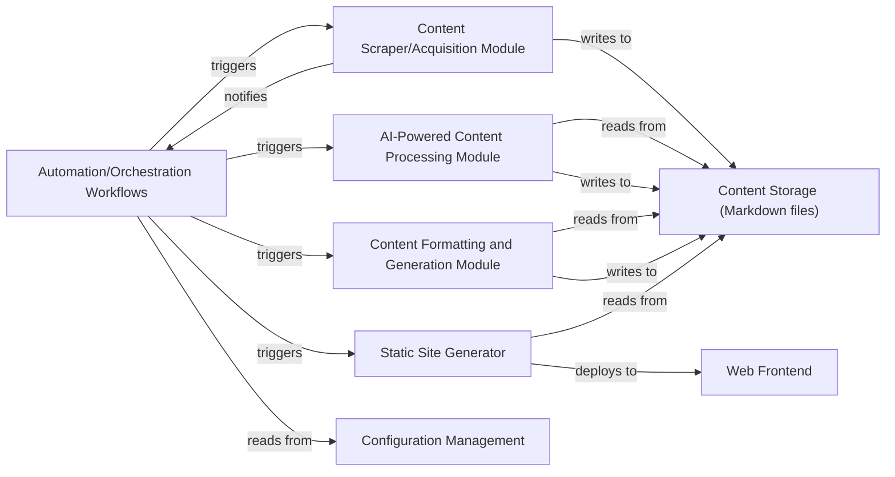

## Details

One paragraph explaining the functionality which is represented by this graph. What the main flow is and what is its purpose.

### Automation/Orchestration Workflows [[Expand]](./Automation_Orchestration_Workflows.md)
Manages and orchestrates the entire content pipeline, including scheduling and executing content acquisition, processing, formatting, generation, and deployment steps. This is primarily implemented using GitHub Actions.

**Related Classes/Methods**:

- `weekly_collection_job.yml` (1:1)
- `weekly_summary_job.yml` (1:1)

### Content Scraper/Acquisition Module
Responsible for gathering raw content from various external sources. This module is likely an external service or a script invoked by the Automation/Orchestration Workflows, as no direct source code is present in this repository.

**Related Classes/Methods**: _None_

### AI-Powered Content Processing Module [[Expand]](./AI_Powered_Content_Processing_Module.md)
Processes acquired raw content using AI/ML models for tasks like summarization, entity extraction, or content enrichment. This module is likely an external service or a script invoked by the Automation/Orchestration Workflows, as no direct source code is present in this repository.

**Related Classes/Methods**: _None_

### Content Formatting and Generation Module
Transforms processed content into a standardized format (e.g., Markdown) suitable for publishing, including adding metadata. This module is likely an external service or a script invoked by the Automation/Orchestration Workflows, as no direct source code is present in this repository.

**Related Classes/Methods**: _None_

### Static Site Generator [[Expand]](./Static_Site_Generator.md)
Takes formatted content (Markdown files) and templates to build the final static website. This is likely an external static site generator tool (e.g., Jekyll, Hugo) used by the Automation/Orchestration Workflows to process the Content Storage (Markdown files). No direct source code is present in this repository.

**Related Classes/Methods**: _None_

### Content Storage (Markdown files)
Repository for all raw, processed, and formatted content, primarily stored as Markdown files with metadata. This corresponds to the docs/ directory in the repository.

**Related Classes/Methods**: _None_

### Configuration Management
Stores and manages all system configurations, including API keys, scheduling parameters, and module-specific settings. This is likely managed through environment variables within GitHub Actions or configuration files for external tools, as no direct source code is present in this repository.

**Related Classes/Methods**: _None_

### Web Frontend
The user-facing presentation layer of the published content, generated by the Static Site Generator. This is the output of the static site generation process, hosted externally, and not part of this repository's codebase.

**Related Classes/Methods**: _None_

### [FAQ](https://github.com/CodeBoarding/GeneratedOnBoardings/tree/main?tab=readme-ov-file#faq)