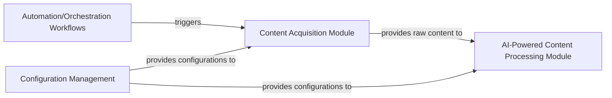

## Details

One paragraph explaining the functionality which is represented by this graph. What the main flow is and what is its purpose.

### Content Acquisition Module [[Expand]](./Content_Acquisition_Module.md)
This module is the primary entry point for raw content, responsible for gathering data from diverse external sources such as RSS feeds, APIs, or web scraping. It acts as the initial ingestion layer for the platform's content pipeline.

**Related Classes/Methods**:

- `resources/weekly_collection.py`

### Automation/Orchestration Workflows [[Expand]](./Automation_Orchestration_Workflows.md)
This component manages and triggers scheduled jobs and automated processes, including the content acquisition routine. It ensures that content ingestion occurs at defined intervals or in response to specific events.

**Related Classes/Methods**:

- `.github/workflows/weekly_collection_job.yml` (1:1)

### Configuration Management
This component is responsible for centralizing and providing all necessary parameters and configurations required by various modules, including connection details for external content sources, scraping rules, or API keys for the `Content Acquisition Module`.

**Related Classes/Methods**:

- `resources/weekly_workflow.py`

### AI-Powered Content Processing Module [[Expand]](./AI_Powered_Content_Processing_Module.md)
This module receives the raw content ingested by the `Content Acquisition Module` for further processing, which may include tasks like natural language processing, summarization, categorization, or entity extraction.

**Related Classes/Methods**:

- `resources/weekly_summary_en.py`
- <a href="https://github.com/chinesehuazhou/python-weekly/blob/main/resources/weekly_translation.py#L1-L1" target="_blank" rel="noopener noreferrer">`resources/weekly_translation.py` (1:1)</a>
- <a href="https://github.com/chinesehuazhou/python-weekly/blob/main/resources/weekly_wordcloud.py#L1-L1" target="_blank" rel="noopener noreferrer">`resources/weekly_wordcloud.py` (1:1)</a>

### [FAQ](https://github.com/CodeBoarding/GeneratedOnBoardings/tree/main?tab=readme-ov-file#faq)