```mermaid
graph LR
    Content_Scraper_Acquisition_Module["Content Scraper/Acquisition Module"]
    AI_Powered_Content_Processing_Module["AI-Powered Content Processing Module"]
    Content_Formatting_and_Generation_Module["Content Formatting and Generation Module"]
    Content_Storage_Markdown_files_["Content Storage (Markdown files)"]
    Static_Site_Generator["Static Site Generator"]
    Automation_Orchestration_Workflows["Automation/Orchestration Workflows"]
    Web_Frontend["Web Frontend"]
    Configuration_Management["Configuration Management"]
    Content_Scraper_Acquisition_Module -- "sends raw content to" --> AI_Powered_Content_Processing_Module
    AI_Powered_Content_Processing_Module -- "sends processed content to" --> Content_Formatting_and_Generation_Module
    Content_Formatting_and_Generation_Module -- "writes formatted content to" --> Content_Storage_Markdown_files_
    Static_Site_Generator -- "reads Markdown content from" --> Content_Storage_Markdown_files_
    Static_Site_Generator -- "generates deployable assets for" --> Web_Frontend
    Automation_Orchestration_Workflows -- "triggers and manages" --> Content_Scraper_Acquisition_Module
    Automation_Orchestration_Workflows -- "initiates site build via" --> Static_Site_Generator
    Configuration_Management -- "provides settings to" --> Content_Scraper_Acquisition_Module
    Configuration_Management -- "provides settings to" --> AI_Powered_Content_Processing_Module
    Configuration_Management -- "provides settings to" --> Content_Formatting_and_Generation_Module
    Configuration_Management -- "provides settings to" --> Static_Site_Generator
    Configuration_Management -- "provides settings to" --> Automation_Orchestration_Workflows
    click AI_Powered_Content_Processing_Module href "https://github.com/CodeBoarding/GeneratedOnBoardings/blob/main/python-weekly/AI_Powered_Content_Processing_Module.md" "Details"
    click Static_Site_Generator href "https://github.com/CodeBoarding/GeneratedOnBoardings/blob/main/python-weekly/Static_Site_Generator.md" "Details"
    click Automation_Orchestration_Workflows href "https://github.com/CodeBoarding/GeneratedOnBoardings/blob/main/python-weekly/Automation_Orchestration_Workflows.md" "Details"
```

## Details

Abstract Components Overview

### Content Scraper/Acquisition Module
Responsible for gathering raw content from various external sources. This module initiates the content pipeline by fetching data that will subsequently be processed and curated.

**Related Classes/Methods**:

- `rss_parser.py` (1:1)

### AI-Powered Content Processing Module [[Expand]](./AI_Powered_Content_Processing_Module.md)
Analyzes, filters, summarizes, and enhances raw content using NLP and AI/ML models. It transforms unstructured data into more refined and valuable information suitable for publication.

**Related Classes/Methods**:

- `llm_summary.py` (1:1)
- `summary_tool.py` (1:1)

### Content Formatting and Generation Module
Takes the processed content and formats it into a structured, standardized format, primarily Markdown, including necessary metadata. This prepares the content for storage and subsequent static site generation.

**Related Classes/Methods**:

- `llm_summary.py:generate_markdown` (1:1)

### Content Storage (Markdown files)
A central repository for all structured Markdown content, including associated metadata. This acts as the single source of truth for all publishable content.

**Related Classes/Methods**:

- `docs/` (1:1)

### Static Site Generator [[Expand]](./Static_Site_Generator.md)
Consumes the structured Markdown content from Content Storage and renders it into a complete, deployable static website (HTML, CSS, JavaScript). This is the core presentation layer component.

**Related Classes/Methods**:

- `mkdocs.yml` (1:1)

### Automation/Orchestration Workflows [[Expand]](./Automation_Orchestration_Workflows.md)
Manages and triggers the entire content pipeline, from acquisition and processing to static site generation and deployment, typically via scheduled jobs or event-driven triggers (e.g., GitHub Actions).

**Related Classes/Methods**:

- `weekly_collection_job.yml` (1:1)
- `weekly_summary_job.yml` (1:1)

### Web Frontend
The final static website, comprising HTML, CSS, and JavaScript files, served to end-users. It is the direct output of the Static Site Generator.

**Related Classes/Methods**:

- `site/` (1:1)

### Configuration Management
Provides centralized management of all system configurations, API keys, environment variables, and operational parameters for all components.

**Related Classes/Methods**:

- `config.py` (1:1)

### [FAQ](https://github.com/CodeBoarding/GeneratedOnBoardings/tree/main?tab=readme-ov-file#faq)