```mermaid
graph LR
    Content_Acquisition_Module["Content Acquisition Module"]
    AI_Powered_Content_Processing_Module["AI-Powered Content Processing Module"]
    Content_Formatting_and_Generation_Module["Content Formatting and Generation Module"]
    Content_Storage["Content Storage"]
    Static_Site_Generator["Static Site Generator"]
    Automation_Orchestration_Workflows["Automation/Orchestration Workflows"]
    Web_Frontend["Web Frontend"]
    Configuration_Management["Configuration Management"]
    Content_Acquisition_Module -- "feeds raw data to" --> AI_Powered_Content_Processing_Module
    Automation_Orchestration_Workflows -- "triggers and manages" --> Content_Acquisition_Module
    Content_Acquisition_Module -- "reads settings from" --> Configuration_Management
    AI_Powered_Content_Processing_Module -- "enriches data and feeds it to" --> Content_Formatting_and_Generation_Module
    Automation_Orchestration_Workflows -- "triggers and manages" --> AI_Powered_Content_Processing_Module
    AI_Powered_Content_Processing_Module -- "reads settings from" --> Configuration_Management
    Content_Formatting_and_Generation_Module -- "produces structured content, stored in" --> Content_Storage
    Automation_Orchestration_Workflows -- "triggers and manages" --> Content_Formatting_and_Generation_Module
    Content_Formatting_and_Generation_Module -- "reads settings from" --> Configuration_Management
    Content_Storage -- "receives content from" --> Content_Formatting_and_Generation_Module
    Static_Site_Generator -- "reads" --> Content_Storage
    Content_Storage -- "reads settings from" --> Configuration_Management
    Static_Site_Generator -- "forms" --> Web_Frontend
    Automation_Orchestration_Workflows -- "triggers and manages" --> Static_Site_Generator
    Static_Site_Generator -- "reads settings from" --> Configuration_Management
    Automation_Orchestration_Workflows -- "reads settings from" --> Configuration_Management
    click Content_Acquisition_Module href "https://github.com/CodeBoarding/GeneratedOnBoardings/blob/main/python-weekly/Content_Acquisition_Module.md" "Details"
    click AI_Powered_Content_Processing_Module href "https://github.com/CodeBoarding/GeneratedOnBoardings/blob/main/python-weekly/AI_Powered_Content_Processing_Module.md" "Details"
    click Static_Site_Generator href "https://github.com/CodeBoarding/GeneratedOnBoardings/blob/main/python-weekly/Static_Site_Generator.md" "Details"
    click Automation_Orchestration_Workflows href "https://github.com/CodeBoarding/GeneratedOnBoardings/blob/main/python-weekly/Automation_Orchestration_Workflows.md" "Details"
```

## Details

Abstract architectural analysis of a content pipeline system.

### Content Acquisition Module [[Expand]](./Content_Acquisition_Module.md)
Responsible for gathering raw content from diverse external sources, such as RSS feeds, APIs, or web scraping. It serves as the initial data ingestion point for the platform.

**Related Classes/Methods**: _None_

### AI-Powered Content Processing Module [[Expand]](./AI_Powered_Content_Processing_Module.md)
Analyzes and enriches the acquired raw content using Natural Language Processing (NLP) and AI/ML models. Key functionalities include summarization, keyword extraction, content categorization, and potentially relevance scoring.

**Related Classes/Methods**: _None_

### Content Formatting and Generation Module
Transforms the processed content into a structured, standardized format, primarily Markdown files with embedded metadata. This module prepares the content for subsequent static site generation.

**Related Classes/Methods**: _None_

### Content Storage
Acts as the persistent layer for all formatted content, typically storing Markdown files within the project's monorepo. This serves as the authoritative source for all published content.

**Related Classes/Methods**: _None_

### Static Site Generator [[Expand]](./Static_Site_Generator.md)
Consumes the structured Markdown content from Content Storage and renders it into a complete, deployable static website (HTML, CSS, JavaScript).

**Related Classes/Methods**: _None_

### Automation/Orchestration Workflows [[Expand]](./Automation_Orchestration_Workflows.md)
Manages and orchestrates the entire content pipeline, including scheduling and executing content acquisition, processing, formatting, generation, and deployment steps. This is primarily implemented using GitHub Actions.

**Related Classes/Methods**: _None_

### Web Frontend
Represents the user-facing presentation layer, displaying the curated content as a navigable website. This is the final output of the static site generation process.

**Related Classes/Methods**: _None_

### Configuration Management
Centralizes and provides configuration parameters required by all other modules, such as API keys, source URLs, output paths, and other system settings.

**Related Classes/Methods**: _None_

### [FAQ](https://github.com/CodeBoarding/GeneratedOnBoardings/tree/main?tab=readme-ov-file#faq)