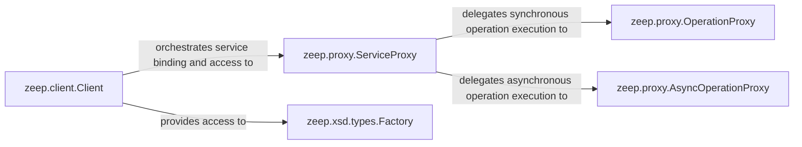

## Details

The `zeep` client subsystem provides a robust framework for interacting with SOAP web services. At its core, the `Client` orchestrates the entire process, from loading WSDL definitions to managing service interactions. It leverages `ServiceProxy` instances to expose callable SOAP operations, which in turn delegate to `OperationProxy` or `AsyncOperationProxy` for synchronous or asynchronous execution, respectively. The `Factory` component, accessible via the `Client`, ensures proper type handling for XML-to-Python data transformations. This design promotes a clear separation of concerns, allowing for flexible and extensible SOAP communication.

### zeep.client.Client
The central orchestrator and primary entry point for interacting with SOAP web services. It is responsible for loading WSDL definitions, managing the overall client configuration, and providing access to services and their operations. It acts as the main facade for the user.

**Related Classes/Methods**:

- <a href="https://github.com/mvantellingen/python-zeep/blob/main/src/zeep/client.py#L38-L222" target="_blank" rel="noopener noreferrer">`zeep.client.Client`:38-222</a>

### zeep.proxy.ServiceProxy
An intermediary component that represents a callable SOAP service or port. It is instantiated by the `Client` and dynamically exposes methods corresponding to the SOAP operations defined in the WSDL, handling the initial preparation and delegation of actual operation invocations. It serves as the user's direct interface to service operations.

**Related Classes/Methods**:

- <a href="https://github.com/mvantellingen/python-zeep/blob/main/src/zeep/proxy.py#L73-L107" target="_blank" rel="noopener noreferrer">`zeep.proxy.ServiceProxy`:73-107</a>

### zeep.proxy.OperationProxy
Responsible for handling the actual synchronous invocation of a specific SOAP operation. It receives the call from `ServiceProxy`, constructs the SOAP request message, sends it via the transport layer, and processes the synchronous response, including merging SOAP headers.

**Related Classes/Methods**:

- <a href="https://github.com/mvantellingen/python-zeep/blob/main/src/zeep/proxy.py#L8-L52" target="_blank" rel="noopener noreferrer">`zeep.proxy.OperationProxy`:8-52</a>

### zeep.proxy.AsyncOperationProxy
Similar to `OperationProxy`, but specifically designed for handling the asynchronous invocation of SOAP operations. It manages non-blocking requests and responses, typically returning futures or similar constructs, and also handles SOAP header merging.

**Related Classes/Methods**:

- <a href="https://github.com/mvantellingen/python-zeep/blob/main/src/zeep/proxy.py#L55-L70" target="_blank" rel="noopener noreferrer">`zeep.proxy.AsyncOperationProxy`:55-70</a>

### zeep.xsd.types.Factory
Manages the creation and resolution of Python types corresponding to the XML Schema (XSD) types defined in the WSDL. It is crucial for the automatic serialization of Python objects to XML and deserialization of XML to Python objects, and is accessed via the `Client`.

**Related Classes/Methods**:

### [FAQ](https://github.com/CodeBoarding/GeneratedOnBoardings/tree/main?tab=readme-ov-file#faq)