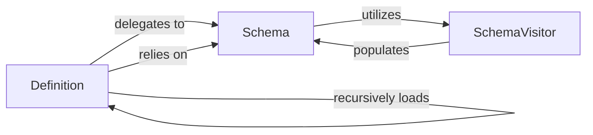

## Details

The `Definition Parsers` subsystem is dedicated to the parsing and interpretation of Web Services Description Language (WSDL) and XML Schema Definition (XSD) documents. Its core function is to extract and organize service operations, message structures, and data type definitions, forming the foundational understanding of a SOAP service contract.

### Definition
This component serves as the primary orchestrator for loading, parsing, and resolving WSDL documents. It manages WSDL imports, processes various WSDL sections (such as types, messages, portTypes, bindings, and services), and integrates associated XSD definitions to form a complete service contract.

**Related Classes/Methods**:

- <a href="https://github.com/mvantellingen/python-zeep/blob/main/src/zeep/wsdl/wsdl.py" target="_blank" rel="noopener noreferrer">`zeep.wsdl.wsdl.Definition`</a>

### Schema
The `Schema` component acts as a comprehensive registry and manager for all XML Schema Definition (XSD) components, including elements, complex types, simple types, attributes, and groups. It provides essential lookup and resolution capabilities for these components, ensuring consistency and reusability across the parsed definitions. It also handles default and imported XSD documents.

**Related Classes/Methods**:

- <a href="https://github.com/mvantellingen/python-zeep/blob/main/src/zeep/xsd/schema.py" target="_blank" rel="noopener noreferrer">`zeep.xsd.schema.Schema`</a>

### SchemaVisitor
This component is responsible for traversing the XML structure of XSD documents. It interprets individual XSD nodes (e.g., `xs:element`, `xs:complexType`, `xs:sequence`, `xs:restriction`, `xs:extension`), extracts their semantic meaning, and registers the corresponding schema components with the `Schema` object.

**Related Classes/Methods**:

- <a href="https://github.com/mvantellingen/python-zeep/blob/main/src/zeep/xsd/visitor.py#L43-L1279" target="_blank" rel="noopener noreferrer">`zeep.xsd.visitor.SchemaVisitor`:43-1279</a>

### [FAQ](https://github.com/CodeBoarding/GeneratedOnBoardings/tree/main?tab=readme-ov-file#faq)