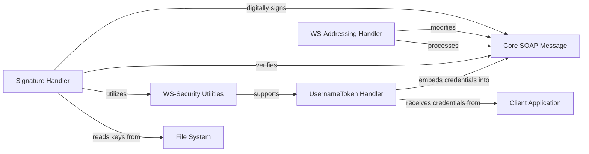

## Details

The `zeep` library's core functionality for handling WS-Security and WS-Addressing within SOAP messages is orchestrated through a set of specialized handlers. The `Client Application` initiates the process by providing credentials, which are then managed by the `UsernameToken Handler` to embed authentication details into the `Core SOAP Message`. Concurrently, the `Signature Handler` ensures message integrity and authenticity by digitally signing parts of the `Core SOAP Message`, relying on cryptographic keys loaded from the `File System`. The `WS-Addressing Handler` further enhances message routing and correlation by modifying the `Core SOAP Message` with addressing headers. These handlers collectively interact with the central `Core SOAP Message` to transform and secure it, with `WS-Security Utilities` providing essential support functions for cryptographic operations.

### UsernameToken Handler
Manages the creation and application of WS-Security UsernameToken for authentication. This involves generating the necessary XML elements (e.g., Username, Password, Nonce, Created) and embedding them into the SOAP header. It also handles password digest creation.

**Related Classes/Methods**:

- <a href="https://github.com/mvantellingen/python-zeep/blob/main/src/zeep/wsse/username.py#L9-L137" target="_blank" rel="noopener noreferrer">`zeep.wsse.username.UsernameToken`:9-137</a>

### Signature Handler
Handles the generation and verification of XML Digital Signatures on SOAP messages. This ensures message integrity and authenticity by signing specific parts of the SOAP envelope and verifying incoming signatures. It manages key loading and cryptographic operations.

**Related Classes/Methods**:

- <a href="https://github.com/mvantellingen/python-zeep/blob/main/src/zeep/wsse/signature.py" target="_blank" rel="noopener noreferrer">`zeep.wsse.signature.Signature`</a>

### WS-Addressing Handler
Adds and processes WS-Addressing headers within SOAP messages. These headers (e.g., To, Action, MessageID, ReplyTo, From) are crucial for message routing, correlation, and endpoint management in a service-oriented architecture.

**Related Classes/Methods**:

- <a href="https://github.com/mvantellingen/python-zeep/blob/main/src/zeep/wsa.py" target="_blank" rel="noopener noreferrer">`zeep.wsa`</a>

### WS-Security Utilities
Provides common utility functions that support WS-Security operations, such as generating unique IDs for XML elements, which is critical for referencing signed parts within an XML Signature.

**Related Classes/Methods**:

- <a href="https://github.com/mvantellingen/python-zeep/blob/main/src/zeep/wsse/utils.py" target="_blank" rel="noopener noreferrer">`zeep.wsse.utils`</a>

### Core SOAP Message
Represents the central SOAP message structure that the Extension Handlers interact with. This component is modified by handlers to embed credentials, digitally sign parts, or inject/extract addressing headers.

**Related Classes/Methods**:

- <a href="https://github.com/mvantellingen/python-zeep/blob/main/src/zeep/wsdl/messages/soap.py" target="_blank" rel="noopener noreferrer">`zeep.wsdl.messages.soap`</a>

### Client Application
The external application or user code that initiates SOAP requests and provides necessary credentials (e.g., username/password) to the UsernameToken Handler. This is an external entity and not part of the zeep library's internal components.

**Related Classes/Methods**: _None_

### File System
An external dependency utilized by the Signature Handler to securely load cryptographic keys (e.g., private keys, certificates) required for signing and verification operations. This is an external dependency and not part of the zeep library's internal components.

**Related Classes/Methods**: _None_

### [FAQ](https://github.com/CodeBoarding/GeneratedOnBoardings/tree/main?tab=readme-ov-file#faq)