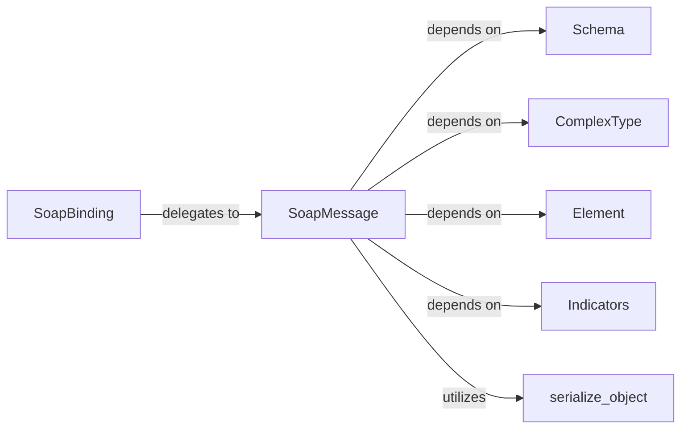

## Details

The core of the `zeep` SOAP subsystem revolves around the `SoapBinding` and `SoapMessage` components. `SoapBinding` orchestrates the overall SOAP communication flow, delegating the intricate details of message construction and deconstruction to `SoapMessage`. `SoapMessage`, in turn, relies heavily on the XML Schema Definition (XSD) components: `Schema`, `ComplexType`, `Element`, and `Indicators`. These XSD components provide the structural metadata necessary for `SoapMessage` to accurately serialize Python objects into XML and deserialize XML back into Python objects, adhering to the service's contract. The `serialize_object` utility function supports `SoapMessage` by handling generic object serialization. This architecture ensures a clear separation of concerns, with `SoapBinding` managing the high-level protocol and `SoapMessage` handling the low-level XML transformations guided by the XSD definitions.

### SoapBinding
Acts as the high-level orchestrator for SOAP message operations within a specific WSDL binding. It manages the lifecycle of a SOAP request and response, delegating the actual XML transformation to SoapMessage. This component is crucial for abstracting the SOAP version-specific details and coordinating the message flow.

**Related Classes/Methods**:

- <a href="https://github.com/mvantellingen/python-zeep/blob/main/src/zeep/wsdl/bindings/soap.py#L24-L302" target="_blank" rel="noopener noreferrer">`SoapBinding`:24-302</a>

### SoapMessage
Represents the concrete structure of a SOAP message (header, body, fault) and is directly responsible for the low-level serialization of Python objects to XML and deserialization of XML to Python objects. It interprets WSDL and XSD definitions to correctly map Python data to XML elements and attributes.

**Related Classes/Methods**:

- <a href="https://github.com/mvantellingen/python-zeep/blob/main/src/zeep/wsdl/messages/soap.py#L24-L418" target="_blank" rel="noopener noreferrer">`SoapMessage`:24-418</a>

### Schema
Represents the parsed XML Schema definitions, providing the foundational understanding of data types, elements, and complex structures. This component is essential for validating and structuring SOAP messages according to the service contract.

**Related Classes/Methods**:

- <a href="https://github.com/mvantellingen/python-zeep/blob/main/src/zeep/xsd/utils.py" target="_blank" rel="noopener noreferrer">`Schema`</a>

### ComplexType
Represents complex type definitions within XML Schema. These definitions guide SoapMessage in how to structure nested Python objects into complex XML elements during serialization and vice-versa during deserialization.

**Related Classes/Methods**:

- <a href="https://github.com/mvantellingen/python-zeep/blob/main/src/zeep/xsd/visitor.py" target="_blank" rel="noopener noreferrer">`ComplexType`</a>

### Element
Represents individual element definitions within XML Schema. This component provides SoapMessage with the necessary metadata (e.g., name, type, min/max occurrences) for handling specific XML elements within the SOAP message body or header.

**Related Classes/Methods**:

- <a href="https://github.com/mvantellingen/python-zeep/blob/main/src/zeep/client.py#L176-L182" target="_blank" rel="noopener noreferrer">`Element`:176-182</a>

### Indicators
Represents XML Schema indicators (e.g., sequence, all, choice), which define the order and cardinality of elements within complex types. This component guides SoapMessage in constructing or parsing the correct sequence of elements.

**Related Classes/Methods**:

### serialize_object
A utility function for generic object serialization tasks. While not directly part of the core SOAP message structure, it provides a reusable mechanism for converting Python objects into a serializable format, utilized by SoapMessage during the transformation process.

**Related Classes/Methods**:

- <a href="https://github.com/mvantellingen/python-zeep/blob/main/src/zeep/helpers.py#L10-L21" target="_blank" rel="noopener noreferrer">`serialize_object`:10-21</a>

### [FAQ](https://github.com/CodeBoarding/GeneratedOnBoardings/tree/main?tab=readme-ov-file#faq)