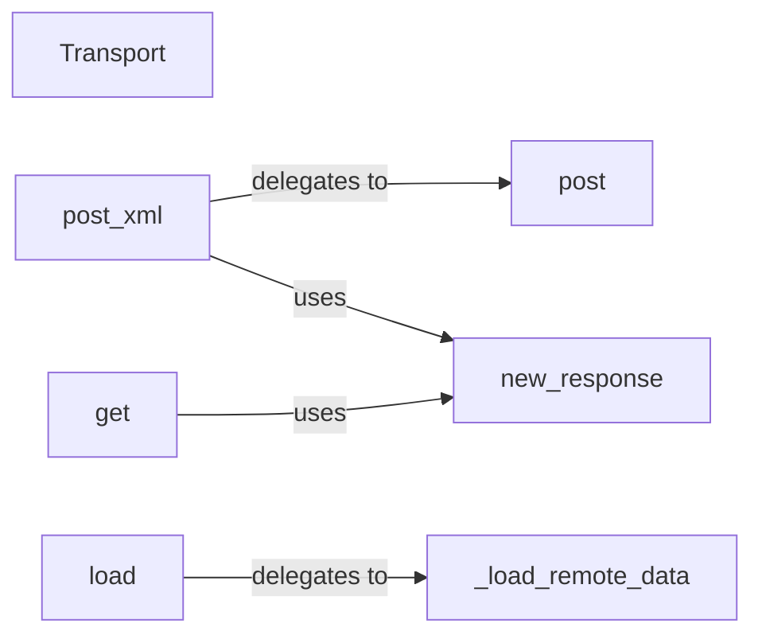

## Details

The Transport Layer subsystem is primarily defined by the zeep.transports module, with zeep.transports.Transport serving as the core component.

### Transport
This component acts as the primary abstraction for all network communication within the Zeep client. It orchestrates the sending of HTTP requests (both POST for SOAP messages and GET for definitions) and the initial processing and standardization of HTTP responses. It also handles the loading of remote data, such as WSDL or XSD definitions, abstracting the underlying HTTP client implementation.

**Related Classes/Methods**:

- <a href="https://github.com/mvantellingen/python-zeep/blob/main/src/zeep/transports.py#L23-L160" target="_blank" rel="noopener noreferrer">`zeep.transports.Transport`:23-160</a>

### post_xml
Orchestrates the SOAP message sending.

**Related Classes/Methods**:

- <a href="https://github.com/mvantellingen/python-zeep/blob/main/src/zeep/transports.py" target="_blank" rel="noopener noreferrer">`zeep.transports.Transport:post_xml`</a>

### post
Handles the low-level HTTP POST request.

**Related Classes/Methods**:

- <a href="https://github.com/mvantellingen/python-zeep/blob/main/src/zeep/transports.py" target="_blank" rel="noopener noreferrer">`zeep.transports.Transport:post`</a>

### new_response
Ensures consistent handling and wrapping of HTTP responses.

**Related Classes/Methods**:

- <a href="https://github.com/mvantellingen/python-zeep/blob/main/src/zeep/transports.py" target="_blank" rel="noopener noreferrer">`zeep.transports.Transport:new_response`</a>

### get
Fetches remote definitions.

**Related Classes/Methods**:

- <a href="https://github.com/mvantellingen/python-zeep/blob/main/src/zeep/transports.py" target="_blank" rel="noopener noreferrer">`zeep.transports.Transport:get`</a>

### load
Public method for fetching remote WSDL/XSD data.

**Related Classes/Methods**:

- <a href="https://github.com/mvantellingen/python-zeep/blob/main/src/zeep/transports.py" target="_blank" rel="noopener noreferrer">`zeep.transports.Transport:load`</a>

### _load_remote_data
Internal method for performing remote data retrieval.

**Related Classes/Methods**:

- <a href="https://github.com/mvantellingen/python-zeep/blob/main/src/zeep/transports.py" target="_blank" rel="noopener noreferrer">`zeep.transports.Transport:_load_remote_data`</a>

### [FAQ](https://github.com/CodeBoarding/GeneratedOnBoardings/tree/main?tab=readme-ov-file#faq)