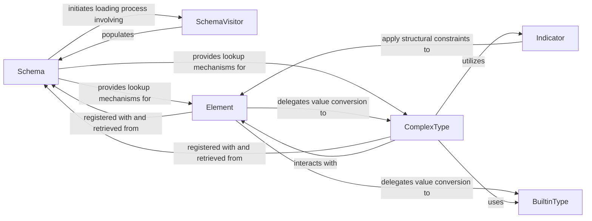

## Details

The `Type System` subsystem in `zeep` is responsible for managing the mapping rules between XML Schema types and their corresponding Python data types, facilitating seamless serialization of Python objects to XML and deserialization of XML responses back to Python.

### Schema
Acts as the central registry and manager for all XML Schema components (elements, types, attributes, groups). It is responsible for loading and parsing XSD documents, registering discovered elements and types, and providing lookup mechanisms for these components. It also orchestrates the top-level deserialization process.

**Related Classes/Methods**:

- <a href="https://github.com/mvantellingen/python-zeep/blob/main/src/zeep/xsd/schema.py" target="_blank" rel="noopener noreferrer">`zeep.xsd.schema.Schema`</a>

### SchemaVisitor
Responsible for traversing and interpreting the XML Schema Definition (XSD) files. It parses the raw XSD document, identifies schema components (elements, types, attributes, groups), and registers them with the `Schema` object, effectively building the in-memory representation of the schema.

**Related Classes/Methods**:

- <a href="https://github.com/mvantellingen/python-zeep/blob/main/src/zeep/xsd/visitor.py#L43-L1279" target="_blank" rel="noopener noreferrer">`zeep.xsd.visitor.SchemaVisitor`:43-1279</a>

### Element
Represents an XML Schema element definition. Its core functions involve converting XML elements into Python objects (parsing) and rendering Python objects back into XML elements. It also handles validation of element content against its schema definition.

**Related Classes/Methods**:

- <a href="https://github.com/mvantellingen/python-zeep/blob/main/src/zeep/xsd/elements/element.py#L20-L325" target="_blank" rel="noopener noreferrer">`zeep.xsd.elements.element.Element`:20-325</a>

### ComplexType
Defines the structure and content model for complex XML types. It manages the serialization and deserialization of complex data by orchestrating the processing of its child elements and attributes. It also handles type derivation through extension and restriction.

**Related Classes/Methods**:

- <a href="https://github.com/mvantellingen/python-zeep/blob/main/src/zeep/xsd/types/complex.py#L43-L511" target="_blank" rel="noopener noreferrer">`zeep.xsd.types.complex.ComplexType`:43-511</a>

### BuiltinType
A collection of classes that provide the fundamental conversion logic between Python native types (e.g., `str`, `int`, `datetime`) and their corresponding XML string representations for standard XSD built-in types.

**Related Classes/Methods**:

- <a href="https://github.com/mvantellingen/python-zeep/blob/main/src/zeep/xsd/types/builtins.py#L19-L21" target="_blank" rel="noopener noreferrer">`zeep.xsd.types.builtins.BuiltinType`:19-21</a>

### Indicator
These components (e.g., `Sequence`, `Choice`, `All`) define and enforce the content model within complex types, specifying the order and occurrence constraints of child elements. They guide the parsing and rendering processes to ensure XML structures conform to the schema.

**Related Classes/Methods**:

- <a href="https://github.com/mvantellingen/python-zeep/blob/main/src/zeep/xsd/elements/indicators.py#L34-L55" target="_blank" rel="noopener noreferrer">`zeep.xsd.elements.indicators.Indicator`:34-55</a>

### [FAQ](https://github.com/CodeBoarding/GeneratedOnBoardings/tree/main?tab=readme-ov-file#faq)