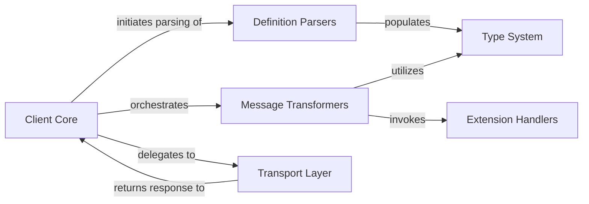

## Details

The `python-zeep` library implements a layered architecture for interacting with SOAP web services, centered around a `Client Core` that orchestrates the entire message exchange. The process begins with `Definition Parsers` interpreting WSDL and XSD documents to establish the service contract and populate the `Type System` with schema-defined data mappings. When a service operation is invoked, the `Client Core` directs `Message Transformers` to serialize Python objects into a SOAP XML request, utilizing the `Type System` for accurate data conversion. Before transmission, `Extension Handlers` can apply security or addressing features to the message. The prepared SOAP message is then sent via the `Transport Layer` over HTTP to the web service. Upon receiving a response, the `Transport Layer` returns it to the `Client Core`, which again uses `Message Transformers` (and `Extension Handlers` for verification) to deserialize the XML back into Python objects. This clear separation of concerns—definition parsing, type mapping, message transformation, extension handling, and network communication—enables a robust, extensible, and maintainable SOAP client.

### Client Core [[Expand]](./Client_Core.md)
The primary user-facing component, orchestrating the entire SOAP request-response lifecycle. It binds to services, invokes operations, and coordinates interactions between all other components.

**Related Classes/Methods**:

- <a href="https://github.com/mvantellingen/python-zeep/blob/main/src/zeep/client.py#L38-L222" target="_blank" rel="noopener noreferrer">`zeep.client.Client`:38-222</a>
- <a href="https://github.com/mvantellingen/python-zeep/blob/main/src/zeep/proxy.py" target="_blank" rel="noopener noreferrer">`zeep.proxy.Proxy`</a>

### Definition Parsers [[Expand]](./Definition_Parsers.md)
Responsible for parsing and interpreting WSDL (Web Services Description Language) and XML Schema Definition (XSD) documents. It extracts service operations, message structures, and data type definitions.

**Related Classes/Methods**:

- <a href="https://github.com/mvantellingen/python-zeep/blob/main/src/zeep/wsdl/wsdl.py" target="_blank" rel="noopener noreferrer">`zeep.wsdl.wsdl.Definition`</a>
- <a href="https://github.com/mvantellingen/python-zeep/blob/main/src/zeep/xsd/schema.py" target="_blank" rel="noopener noreferrer">`zeep.xsd.schema.Schema`</a>
- <a href="https://github.com/mvantellingen/python-zeep/blob/main/src/zeep/xsd/visitor.py#L43-L1279" target="_blank" rel="noopener noreferrer">`zeep.xsd.visitor.SchemaVisitor`:43-1279</a>

### Type System [[Expand]](./Type_System.md)
Manages the mapping rules between XML Schema types and their corresponding Python data types. This component is crucial for seamless serialization of Python objects to XML and deserialization of XML responses back to Python.

**Related Classes/Methods**:

- <a href="https://github.com/mvantellingen/python-zeep/blob/main/src/zeep/xsd/elements/element.py#L20-L325" target="_blank" rel="noopener noreferrer">`zeep.xsd.elements.element.Element`:20-325</a>
- <a href="https://github.com/mvantellingen/python-zeep/blob/main/src/zeep/xsd/types/complex.py#L43-L511" target="_blank" rel="noopener noreferrer">`zeep.xsd.types.complex.ComplexType`:43-511</a>

### Message Transformers [[Expand]](./Message_Transformers.md)
Handles the construction of outgoing SOAP XML request envelopes from Python objects (serialization) and the parsing of incoming SOAP XML response envelopes back into Python objects (deserialization), adhering to WSDL and XSD definitions.

**Related Classes/Methods**:

- <a href="https://github.com/mvantellingen/python-zeep/blob/main/src/zeep/wsdl/bindings/soap.py#L24-L302" target="_blank" rel="noopener noreferrer">`zeep.wsdl.bindings.soap.SoapBinding`:24-302</a>
- <a href="https://github.com/mvantellingen/python-zeep/blob/main/src/zeep/wsdl/messages/soap.py#L24-L418" target="_blank" rel="noopener noreferrer">`zeep.wsdl.messages.soap.SoapMessage`:24-418</a>

### Transport Layer [[Expand]](./Transport_Layer.md)
Manages the actual network communication. It sends HTTP requests containing SOAP messages to the web service endpoint and receives HTTP responses, abstracting the underlying communication mechanism.

**Related Classes/Methods**:

- <a href="https://github.com/mvantellingen/python-zeep/blob/main/src/zeep/transports.py#L23-L160" target="_blank" rel="noopener noreferrer">`zeep.transports.Transport`:23-160</a>

### Extension Handlers [[Expand]](./Extension_Handlers.md)
Provides modular mechanisms for applying and verifying various SOAP extensions, suchs as WS-Security (e.g., UsernameToken for authentication, XML Signatures for integrity) and WS-Addressing for message routing.

**Related Classes/Methods**:

- <a href="https://github.com/mvantellingen/python-zeep/blob/main/src/zeep/wsse/username.py#L9-L137" target="_blank" rel="noopener noreferrer">`zeep.wsse.username.UsernameToken`:9-137</a>
- <a href="https://github.com/mvantellingen/python-zeep/blob/main/src/zeep/wsse/signature.py" target="_blank" rel="noopener noreferrer">`zeep.wsse.signature.Signature`</a>
- <a href="https://github.com/mvantellingen/python-zeep/blob/main/src/zeep/wsa.py" target="_blank" rel="noopener noreferrer">`zeep.wsa`</a>

### [FAQ](https://github.com/CodeBoarding/GeneratedOnBoardings/tree/main?tab=readme-ov-file#faq)