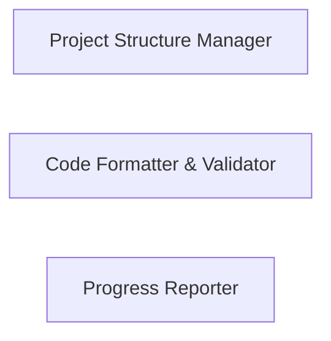

## Details

The user is trying to identify source code references for 'Code Formatter & Validator', 'Project Structure Manager', and 'Progress Reporter'. They have identified `backend/project_manager.py` as a strong candidate for 'Project Structure Manager' and will read its content. They need to conduct further investigation for the other two components.

### Project Structure Manager
Manages the overall structure and organization of the project, including file creation, deletion, and navigation.

**Related Classes/Methods**: _None_

### Code Formatter & Validator
Formats and validates the generated Python code to ensure it adheres to PEP 8 guidelines and other best practices.

**Related Classes/Methods**: _None_

### Progress Reporter
Provides real-time updates on the code generation process, including progress, errors, and completion status.

**Related Classes/Methods**: _None_

### [FAQ](https://github.com/CodeBoarding/GeneratedOnBoardings/tree/main?tab=readme-ov-file#faq)