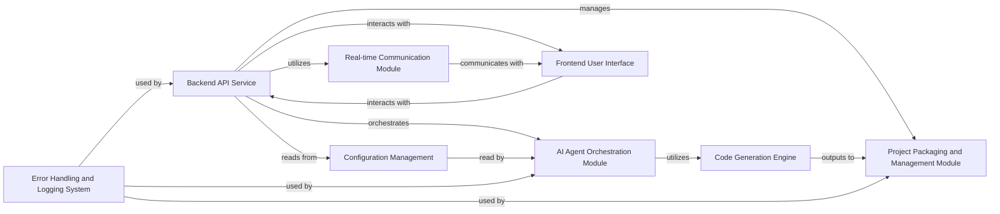

## Details

Component overview for the Backend API Service subsystem of an AI-Powered Code Generation Platform.

### Backend API Service [[Expand]](./Backend_API_Service.md)
Acts as the central hub for the backend. It exposes REST API endpoints for the frontend, handles incoming requests, orchestrates the AI agents, manages project storage, and facilitates real-time communication. It's built with Flask.

**Related Classes/Methods**:

- `app`

### AI Agent Orchestration Module
Responsible for defining, managing, and executing the multi-agent workflows using CrewAI. It coordinates agent roles, tasks, and processes, and interfaces with the underlying AI models for code generation.

**Related Classes/Methods**:

- <a href="https://github.com/dhruvinhet/python_code_generator/blob/master/backend/agents.py" target="_blank" rel="noopener noreferrer">`agents`</a>

### Project Packaging and Management Module
Handles the storage, organization, and packaging of generated code projects. This includes creating directories, writing files, and generating ZIP archives for download.

**Related Classes/Methods**:

- <a href="https://github.com/dhruvinhet/python_code_generator/blob/master/backend/project_manager.py" target="_blank" rel="noopener noreferrer">`project_manager`</a>

### Real-time Communication Module
Manages WebSocket connections (Socket.IO) to provide live progress updates and notifications from the backend to the frontend during long-running AI tasks.

**Related Classes/Methods**:

- `app_socket_io`

### Frontend User Interface [[Expand]](./Frontend_User_Interface.md)
The client-side application built with React and Node.js, providing the user interface for interacting with the code generation platform. It sends requests to the Backend API and displays real-time updates.

**Related Classes/Methods**:

- `frontend_src`

### Code Generation Engine [[Expand]](./Code_Generation_Engine.md)
The core logic responsible for interacting with Google Generative AI models (Gemini) to produce code based on prompts and agent instructions. This is where the actual AI-powered code generation happens.

**Related Classes/Methods**:

- `llm_interface`

### Configuration Management
Manages application settings, API keys (e.g., Google Gemini API key), and other environment-specific configurations, ensuring secure and flexible deployment.

**Related Classes/Methods**:

- `env_files`
- `config`

### Error Handling and Logging System
Provides centralized mechanisms for capturing, logging, and reporting errors across the backend, especially for AI interactions, file operations, and API requests, crucial for debugging and monitoring.

**Related Classes/Methods**:

- `logger`

### [FAQ](https://github.com/CodeBoarding/GeneratedOnBoardings/tree/main?tab=readme-ov-file#faq)