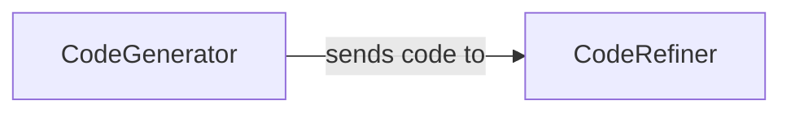

## Details

One paragraph explaining the functionality which is represented by this graph. What the main flow is and what is its purpose.

### CodeGenerator
Responsible for the initial creation of code snippets or full modules by leveraging the Google Generative AI model. It translates high-level instructions or prompts into executable code.

**Related Classes/Methods**:

- `python_code_generator.generator.CodeGenerator`
- `python_code_generator.generator.CodeGenerator:generate`

### CodeRefiner
Focuses on improving, correcting, and validating the code generated by the `CodeGenerator`. This includes addressing errors, optimizing code, or adapting it to specific constraints.

**Related Classes/Methods**:

- `python_code_generator.refiner.CodeRefiner`
- `python_code_generator.refiner.CodeRefiner:refine`

### [FAQ](https://github.com/CodeBoarding/GeneratedOnBoardings/tree/main?tab=readme-ov-file#faq)