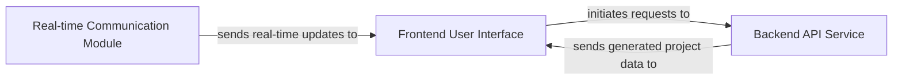

## Details

One paragraph explaining the functionality which is represented by this graph. What the main flow is and what is its purpose.

### Frontend User Interface [[Expand]](./Frontend_User_Interface.md)
The Frontend User Interface serves as the primary interactive web interface for users. It enables users to initiate code generation requests to the `Backend API Service`, receives real-time progress updates from the `Real-time Communication Module` during the generation process, and allows for the download of the final generated projects provided by the `Backend API Service`. This component is built using React for the user interface and Node.js for its runtime environment.

**Related Classes/Methods**:

- `App`

### Backend API Service [[Expand]](./Backend_API_Service.md)
The Backend API Service is responsible for processing code generation requests initiated by the `Frontend User Interface`. It handles the core logic for generating project data and subsequently sends the completed generated project data back to the `Frontend User Interface` for download.

**Related Classes/Methods**: _None_

### Real-time Communication Module
The Real-time Communication Module is dedicated to providing real-time updates to the `Frontend User Interface`. This module ensures that users receive immediate feedback on the progress of their code generation requests, enhancing the interactive experience.

**Related Classes/Methods**: _None_

### [FAQ](https://github.com/CodeBoarding/GeneratedOnBoardings/tree/main?tab=readme-ov-file#faq)