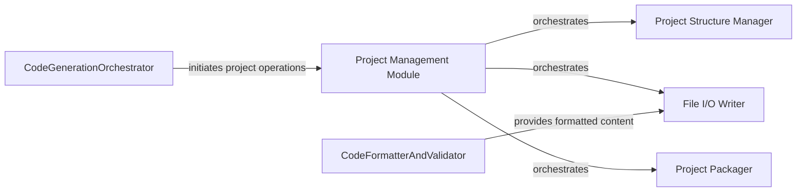

## Details

Abstract Components Overview

### Project Management Module [[Expand]](./Project_Management_Module.md)
The overarching module responsible for the complete lifecycle management of generated code projects. It acts as the primary interface for other system components to interact with the file system for project persistence, orchestrating the creation of directories, saving files, and packaging projects.

**Related Classes/Methods**:

- `project_manager.py`

### Project Structure Manager
An internal sub-component of the `Project Management Module` dedicated to defining and creating the hierarchical directory structure for new projects. It ensures a consistent and logical layout for all generated files (e.g., `src`, `tests`, `config`).

**Related Classes/Methods**:

- `project_manager.py`

### File I/O Writer
An internal sub-component of the `Project Management Module` responsible for the actual writing of code content and other project assets to the file system. It handles the low-level file operations, ensuring data integrity and correct placement within the project structure.

**Related Classes/Methods**:

- `project_manager.py`

### Project Packager
An internal sub-component of the `Project Management Module` tasked with compressing the complete generated project into a distributable archive format (e.g., ZIP file). This facilitates easy sharing, download, and deployment of the generated code.

**Related Classes/Methods**:

- `project_manager.py`

### CodeGenerationOrchestrator
An external component responsible for orchestrating the overall code generation workflow. It initiates the process of creating, saving, and managing generated projects by interacting with the `Project Management Module`.

**Related Classes/Methods**:

- `backend.agents.Agent`

### CodeFormatterAndValidator
An external component that processes and refines the raw generated code, ensuring it adheres to coding standards and is syntactically correct, before it is handed over for persistence.

**Related Classes/Methods**:

- `backend.json_parser.JsonParser`

### [FAQ](https://github.com/CodeBoarding/GeneratedOnBoardings/tree/main?tab=readme-ov-file#faq)