```mermaid
graph LR
    Frontend_User_Interface["Frontend User Interface"]
    Backend_API_Service["Backend API Service"]
    AI_Agent_Orchestration["AI Agent Orchestration"]
    Code_Generation_Engine["Code Generation Engine"]
    Project_Management_Module["Project Management Module"]
    Frontend_User_Interface -- "sends requests to" --> Backend_API_Service
    Frontend_User_Interface -- "receives real-time updates from" --> Backend_API_Service
    Backend_API_Service -- "orchestrates" --> AI_Agent_Orchestration
    Backend_API_Service -- "manages" --> Project_Management_Module
    AI_Agent_Orchestration -- "utilizes" --> Code_Generation_Engine
    Code_Generation_Engine -- "provides output to" --> AI_Agent_Orchestration
    click Frontend_User_Interface href "https://github.com/CodeBoarding/GeneratedOnBoardings/blob/main/python_code_generator/Frontend_User_Interface.md" "Details"
    click Backend_API_Service href "https://github.com/CodeBoarding/GeneratedOnBoardings/blob/main/python_code_generator/Backend_API_Service.md" "Details"
    click AI_Agent_Orchestration href "https://github.com/CodeBoarding/GeneratedOnBoardings/blob/main/python_code_generator/AI_Agent_Orchestration.md" "Details"
    click Code_Generation_Engine href "https://github.com/CodeBoarding/GeneratedOnBoardings/blob/main/python_code_generator/Code_Generation_Engine.md" "Details"
    click Project_Management_Module href "https://github.com/CodeBoarding/GeneratedOnBoardings/blob/main/python_code_generator/Project_Management_Module.md" "Details"
```

## Details

The `python_code_generator` project is an AI-Powered Code Generation Platform built as a multi-agent system with a web interface, following a client-server architecture with real-time communication. The main flow begins with the Frontend User Interface where users submit code generation requests. These requests are sent to the Backend API Service, which acts as the central hub, orchestrating the entire process. The Backend API Service then delegates the core AI workflow to the AI Agent Orchestration module, which coordinates various specialized AI agents. These agents, in turn, leverage the Code Generation Engine to interact with the generative AI model for generating and refining code. Throughout this process, the Backend API Service utilizes the Project Management Module to store and organize the generated code. Real-time progress updates are pushed from the Backend API Service back to the Frontend User Interface via WebSockets, providing a live view of the generation process.

### Frontend User Interface [[Expand]](./Frontend_User_Interface.md)
Provides the interactive web interface for users to initiate code generation requests, view progress updates, and download generated projects. It's built with React and Node.js.

**Related Classes/Methods**:

- `App.js`
- `components/`

### Backend API Service [[Expand]](./Backend_API_Service.md)
Acts as the central hub for the backend. It exposes REST API endpoints for the frontend, handles incoming requests, orchestrates the AI agents, manages project storage, and facilitates real-time communication. It's built with Flask.

**Related Classes/Methods**:

- `app.py`

### AI Agent Orchestration [[Expand]](./AI_Agent_Orchestration.md)
Manages the workflow of various AI agents (e.g., planning, coding, reviewing, testing) to fulfill a code generation request, coordinating their interactions within the multi-agent system.

**Related Classes/Methods**:

- `python_code_generator.orchestrator.Orchestrator`
- `python_code_generator.orchestrator.Orchestrator.run`
- `agents.py`
- `agents_crewai.py`
- `agents_simple.py`

### Code Generation Engine [[Expand]](./Code_Generation_Engine.md)
Contains the core logic for interacting with the Google Generative AI model to generate, refine, and validate code based on instructions from the AI Agent Orchestration.

**Related Classes/Methods**:

- `python_code_generator.generator.CodeGenerator`
- `python_code_generator.generator.CodeGenerator.generate`
- `python_code_generator.refiner.CodeRefiner`
- `python_code_generator.refiner.CodeRefiner.refine`
- `agents.py`

### Project Management Module [[Expand]](./Project_Management_Module.md)
Handles the storage, organization, and retrieval of generated code projects, including creating directories, saving files, and packaging projects into ZIP files.

**Related Classes/Methods**:

- `project_manager.py`

### [FAQ](https://github.com/CodeBoarding/GeneratedOnBoardings/tree/main?tab=readme-ov-file#faq)