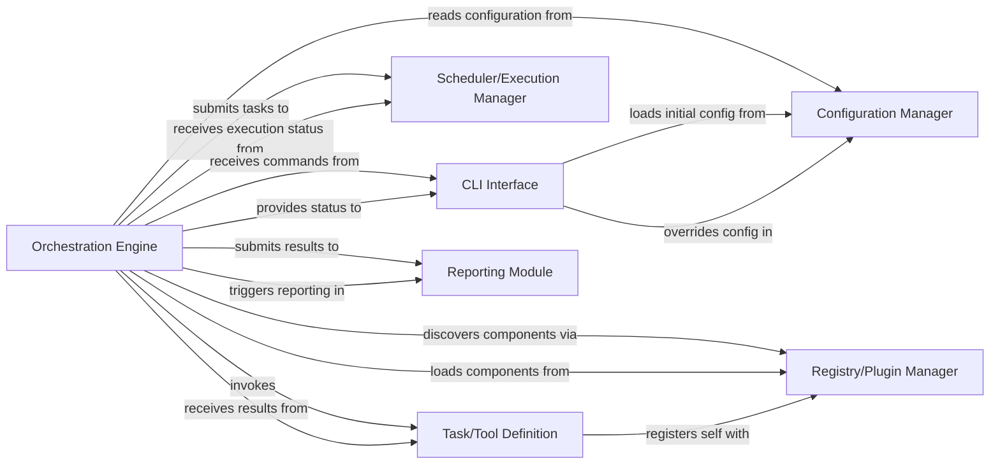

## Details

One paragraph explaining the functionality which is represented by this graph. What the main flow is and what is its purpose.

### Orchestration Engine [[Expand]](./Orchestration_Engine.md)
The central control unit responsible for initiating, coordinating, and managing the overall execution flow of tests or tasks. It drives the main execution loop, integrates functionalities from other components, and orchestrates the execution of defined tasks/tools.

**Related Classes/Methods**:

- <a href="https://github.com/WULPUS/python_testbench/blob/main/src/testbench/testbench.py#L17-L230" target="_blank" rel="noopener noreferrer">`testbench.testbench.Testbench` (17:230)</a>

### Configuration Manager
Manages the loading, parsing, and access of system-wide and task-specific configurations. It provides a centralized mechanism for other components to retrieve operational parameters and settings.

**Related Classes/Methods**:

- `common.config`

### Task/Tool Definition
Defines the interfaces and base classes for various types of executable units (e.g., tests, utilities, file operations). These definitions allow the framework to understand and interact with different "plugins" or "extensions."

**Related Classes/Methods**:

- `tool`
- `tools`
- `file`
- `files`
- `tasks`

### Registry/Plugin Manager
A centralized system for registering, discovering, and retrieving available tasks, tools, and other extensions. It enables dynamic loading and management of components, supporting the framework's extensibility.

**Related Classes/Methods**:

- `registry` (1:1)
- `tool`
- `file`
- `tasks`

### Scheduler/Execution Manager
Responsible for managing the timing, order, and dependencies of task execution. It determines when and how tasks are run, potentially handling parallel execution or sequential workflows.

**Related Classes/Methods**:

- `schedule`

### CLI Interface
Handles the parsing of command-line arguments, user input, and dispatches commands to the appropriate internal components. It serves as the primary interaction point for users of the framework.

**Related Classes/Methods**:

- `cli` (1:1)
- `main` (1:1)

### Reporting Module
Collects, processes, and presents the outcomes of executed tasks or tests. It generates reports, summaries, and detailed logs, providing feedback on the execution status and results.

**Related Classes/Methods**:

- `reporter` (1:1)
- `results` (1:1)

### [FAQ](https://github.com/CodeBoarding/GeneratedOnBoardings/tree/main?tab=readme-ov-file#faq)