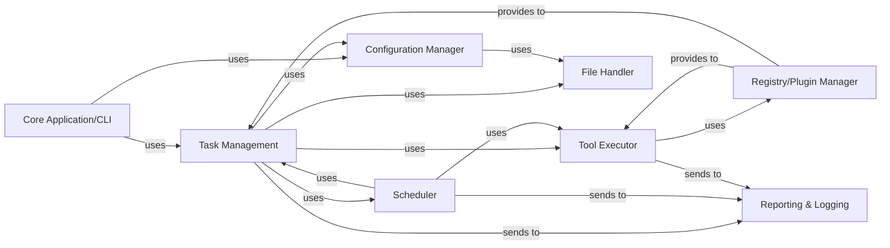

## Details

One paragraph explaining the functionality which is represented by this graph. What the main flow is and what is its purpose.

### Core Application/CLI
The primary entry point for the `python_testbench` framework. It is responsible for parsing command-line arguments, initializing the system, and orchestrating the overall execution flow based on user input. It acts as the main interface for users to interact with the testbench.

**Related Classes/Methods**:

- `testbench.py`

### Task Management [[Expand]](./Task_Management.md)
Defines, organizes, and manages the lifecycle of individual tasks or test cases within the `python_testbench` framework. It provides the structure and mechanisms for tasks to be scheduled, their execution flow to be dictated, and ensures they are performed in the correct sequence and under specified conditions. It serves as the blueprint for the `Scheduler` and `Tool Executor`.

**Related Classes/Methods**:

- `testbench.tasks`

### Scheduler
Responsible for the actual scheduling and execution of tasks defined by the `Task Management` component. It dictates the order and timing of task execution, managing sequential or parallel flows as required by the task definitions.

**Related Classes/Methods**:

- <a href="https://github.com/WULPUS/python_testbench/blob/main/src/testbench/schedule.py#L6-L212" target="_blank" rel="noopener noreferrer">`testbench.schedule.TestbenchSchedule` (6:212)</a>

### Tool Executor
Manages the execution of specific "tools" or actions that individual tasks utilize. It acts as an interface for tasks to invoke external or internal functionalities required for their completion, abstracting the underlying implementation details of each tool.

**Related Classes/Methods**:

- <a href="https://github.com/WULPUS/python_testbench/blob/main/src/testbench/tool.py" target="_blank" rel="noopener noreferrer">`tool.py`</a>
- `tools.py`

### Configuration Manager
Handles the loading, parsing, and management of configuration settings for the entire framework and individual tasks. It ensures that components operate according to specified parameters, supporting a configuration-driven design.

**Related Classes/Methods**:

- <a href="https://github.com/WULPUS/python_testbench/blob/main/src/testbench/common/config.py" target="_blank" rel="noopener noreferrer">`common/config.py`</a>

### File Handler
Provides standardized mechanisms for interacting with the file system. This includes reading and writing test data, configuration files, and potentially storing test results or logs.

**Related Classes/Methods**:

- `file.py`
- `files.py`

### Registry/Plugin Manager
Implements the Registry Pattern, allowing for dynamic discovery and registration of various components such as tools, task types, or reporters. This central registry enables the framework's extensibility and modularity.

**Related Classes/Methods**: _None_

### Reporting & Logging
Manages the output of test results, task outcomes, and system events. It provides mechanisms for logging information, warnings, and errors, which are crucial for debugging, analysis, and providing feedback on the execution of tasks.

**Related Classes/Methods**: _None_

### [FAQ](https://github.com/CodeBoarding/GeneratedOnBoardings/tree/main?tab=readme-ov-file#faq)