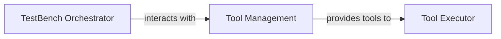

## Details

Overview of the TestBench system's abstract components and their relationships.

### TestBench Orchestrator
This component, likely represented by `testbench.testbench.Testbench`, acts as the central orchestrator for the entire testbench execution process. Its primary responsibility is to manage the flow of test execution, coordinate various sub-processes, and interact with other components like `Tool Management` to acquire and utilize necessary tools. It ensures that tests are executed according to the defined schedule and configurations, driving the overall testing workflow.

**Related Classes/Methods**:

- <a href="https://github.com/WULPUS/python_testbench/blob/main/src/testbench/testbench.py#L17-L230" target="_blank" rel="noopener noreferrer">`testbench.testbench.Testbench` (17:230)</a>

### Tool Management [[Expand]](./Tool_Management.md)
This component serves as the central hub for managing all external and internal tools within the `testbench` framework. It implements a 'Registry Pattern' to facilitate the 'Plugin/Extension Architecture', enabling the system to dynamically discover, register, and provide access to various tools. Its core responsibilities include maintaining a registry of available tools, offering mechanisms for tool lookup, and ensuring a standardized interface for tool integration. This design is fundamental for the framework's extensibility, allowing new functionalities to be added without modifying core logic.

**Related Classes/Methods**:

- <a href="https://github.com/WULPUS/python_testbench/blob/main/src/testbench/tools.py#L8-L70" target="_blank" rel="noopener noreferrer">`testbench.tools.TestbenchTools` (8:70)</a>

### Tool Executor
This component is responsible for the actual execution of tools provided by the `Tool Management` component. It acts as the consumer of tools, taking registered tools and invoking their functionalities as required by the `TestBench Orchestrator` during test execution. While not directly mapped to a single class in the provided context, it represents the operational aspect of utilizing the tools within the testbench framework.

**Related Classes/Methods**: _None_

### [FAQ](https://github.com/CodeBoarding/GeneratedOnBoardings/tree/main?tab=readme-ov-file#faq)