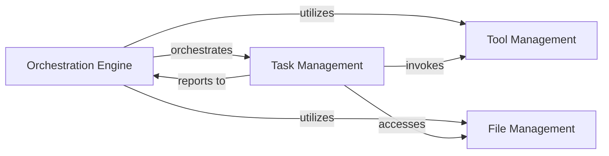

## Details

One paragraph explaining the functionality which is represented by this graph. What the main flow is and what is its purpose.

### Orchestration Engine [[Expand]](./Orchestration_Engine.md)
The central control unit responsible for initiating, coordinating, and managing the overall execution flow of tests or tasks. It drives the main execution loop and integrates functionalities from other components.

**Related Classes/Methods**:

- <a href="https://github.com/WULPUS/python_testbench/blob/main/src/testbench/testbench.py#L17-L230" target="_blank" rel="noopener noreferrer">`testbench.testbench.Testbench` (17:230)</a>

### Task Management [[Expand]](./Task_Management.md)
Defines and manages the lifecycle of individual tasks or test cases. It handles the scheduling of tasks, dictates their execution flow, and ensures tasks are performed in the correct sequence and under specified conditions.

**Related Classes/Methods**:

- <a href="https://github.com/WULPUS/python_testbench/blob/main/src/testbench/tasks.py#L4-L110" target="_blank" rel="noopener noreferrer">`testbench.tasks.TestbenchTasks` (4:110)</a>

### Tool Management [[Expand]](./Tool_Management.md)
Provides a standardized interface and registry for various external or internal tools. It manages the registration, discovery, and access of these tools, allowing the framework to extend its capabilities seamlessly.

**Related Classes/Methods**:

- <a href="https://github.com/WULPUS/python_testbench/blob/main/src/testbench/tools.py#L8-L70" target="_blank" rel="noopener noreferrer">`testbench.tools.TestbenchTools` (8:70)</a>

### File Management
Offers a standardized interface for handling file-related operations and managing specific "file" types or configurations crucial for task execution or test setup. It ensures consistent access and manipulation of necessary data assets.

**Related Classes/Methods**:

- <a href="https://github.com/WULPUS/python_testbench/blob/main/src/testbench/files.py#L8-L54" target="_blank" rel="noopener noreferrer">`testbench.files.TestbenchFiles` (8:54)</a>

### [FAQ](https://github.com/CodeBoarding/GeneratedOnBoardings/tree/main?tab=readme-ov-file#faq)