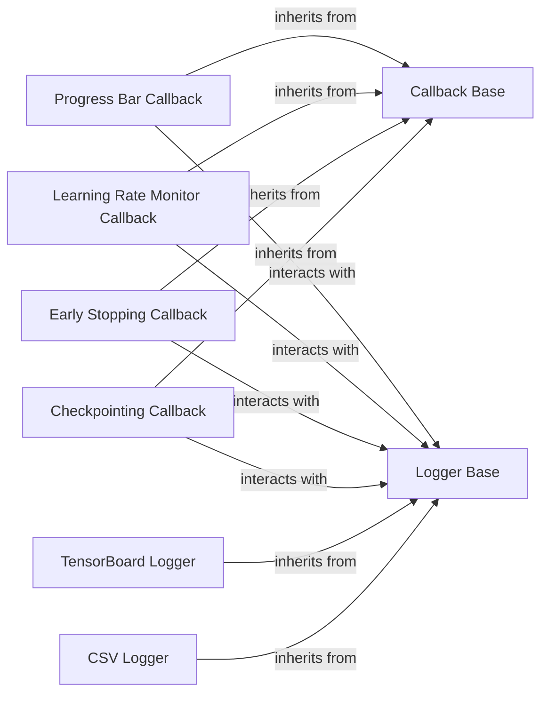

## Component Details

This subsystem provides a robust and flexible mechanism for extending PyTorch Lightning's training process and for comprehensive experiment tracking. It is primarily composed of two core abstractions: `Callbacks` and `Loggers`. Callbacks allow users to inject custom logic at various points during the training lifecycle, while Loggers facilitate the recording and visualization of experiment metrics and hyperparameters.

### Callback Base
The abstract base class that defines the interface and lifecycle hooks for all callbacks in PyTorch Lightning. It provides a standardized way for users to inject custom logic at various points during the training, validation, testing, and prediction loops (e.g., `on_train_start`, `on_train_end`, `on_epoch_end`). All custom callbacks must inherit from this class.

**Related Classes/Methods**:

- <a href="https://github.com/Lightning-AI/pytorch-lightning/blob/master/src/lightning/pytorch/callbacks/callback.py#L24-L285" target="_blank" rel="noopener noreferrer">`Callback` (24:285)</a>

### Checkpointing Callback
A concrete implementation of `Callback` responsible for saving and loading model checkpoints during training. `ModelCheckpoint` is the primary implementation, allowing users to save models based on various criteria (e.g., best model, last model, or at specific intervals).

**Related Classes/Methods**:

- <a href="https://github.com/Lightning-AI/pytorch-lightning/blob/master/src/lightning/pytorch/callbacks/model_checkpoint.py#L49-L804" target="_blank" rel="noopener noreferrer">`ModelCheckpoint` (49:804)</a>

### Early Stopping Callback
A concrete `Callback` that monitors a specified metric (e.g., validation loss) and stops training if the metric does not improve for a certain number of epochs (patience).

**Related Classes/Methods**:

- <a href="https://github.com/Lightning-AI/pytorch-lightning/blob/master/src/lightning/pytorch/callbacks/early_stopping.py#L36-L272" target="_blank" rel="noopener noreferrer">`EarlyStopping` (36:272)</a>

### Learning Rate Monitor Callback
A concrete `Callback` that automatically logs the learning rates of optimizers to the configured logger.

**Related Classes/Methods**:

- `LearningRateMonitor` (1:1)

### Progress Bar Callback
An abstract base class (`ProgressBar`) for displaying training progress to the user, with `TQDMProgressBar` being a common concrete implementation. It provides visual feedback on epoch, batch, and metric progress.

**Related Classes/Methods**:

- <a href="https://github.com/Lightning-AI/pytorch-lightning/blob/master/src/lightning/pytorch/callbacks/progress/progress_bar.py#L22-L209" target="_blank" rel="noopener noreferrer">`ProgressBar` (22:209)</a>
- `TQDMProgressBar` (1:1)

### Logger Base
The abstract base class that defines the interface for all loggers in PyTorch Lightning. It provides a consistent API for logging various types of data, such as hyperparameters, metrics (scalars, images, audio, text), and artifacts, to different experiment tracking platforms.

**Related Classes/Methods**:

- <a href="https://github.com/Lightning-AI/pytorch-lightning/blob/master/src/lightning/fabric/loggers/logger.py#L26-L98" target="_blank" rel="noopener noreferrer">`Logger` (26:98)</a>

### CSV Logger
A concrete logger implementation that saves experiment data (hyperparameters and metrics) to CSV files.

**Related Classes/Methods**:

- `CSVLogger` (1:1)

### TensorBoard Logger
A concrete logger implementation that integrates with Google's TensorBoard for rich visualization of experiment data. It allows users to visualize scalars, images, histograms, and model graphs.

**Related Classes/Methods**:

- `TensorBoardLogger` (1:1)

### [FAQ](https://github.com/CodeBoarding/GeneratedOnBoardings/tree/main?tab=readme-ov-file#faq)