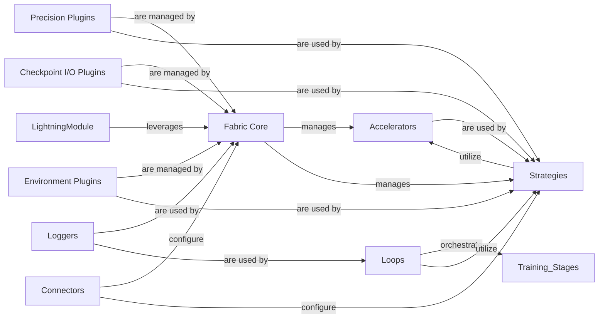

## Component Details

Abstract Components Overview

### Fabric Core
The foundational API (`lightning.fabric.fabric.Fabric`) that orchestrates distributed training primitives, device management, and low-level training loops. It serves as the central entry point for hardware and distributed abstraction, unifying the various plugins and strategies.

**Related Classes/Methods**:

- <a href="https://github.com/Lightning-AI/pytorch-lightning/blob/master/src/lightning/fabric/fabric.py#L81-L1060" target="_blank" rel="noopener noreferrer">`lightning.fabric.fabric.Fabric` (81:1060)</a>

### Accelerators
Provides an abstract interface (`lightning.fabric.accelerators.accelerator.Accelerator`) for interacting with different hardware devices (CPU, CUDA, MPS, XLA). Concrete implementations handle device-specific operations, enabling hardware-agnostic training. Both `lightning.fabric` and `lightning.pytorch` provide implementations.

**Related Classes/Methods**:

- <a href="https://github.com/Lightning-AI/pytorch-lightning/blob/master/src/lightning/fabric/accelerators/accelerator.py#L21-L60" target="_blank" rel="noopener noreferrer">`lightning.fabric.accelerators.accelerator.Accelerator` (21:60)</a>

### Strategies
Defines abstract interfaces (`lightning.fabric.strategies.strategy.Strategy`) for various distributed training paradigms (e.g., DDP, FSDP, DeepSpeed, Single Device). These strategies manage how models and data are distributed and synchronized across devices. Both `lightning.fabric` and `lightning.pytorch` provide implementations.

**Related Classes/Methods**:

- <a href="https://github.com/Lightning-AI/pytorch-lightning/blob/master/src/lightning/fabric/strategies/strategy.py#L41-L411" target="_blank" rel="noopener noreferrer">`lightning.fabric.strategies.strategy.Strategy` (41:411)</a>

### Precision Plugins
Offers an abstract interface (`lightning.fabric.plugins.precision.precision.Precision`) for managing mixed-precision training (e.g., AMP, bfloat16, float16). These plugins handle the casting of tensors to different data types for performance optimization. Both `lightning.fabric` and `lightning.pytorch` provide implementations.

**Related Classes/Methods**:

- <a href="https://github.com/Lightning-AI/pytorch-lightning/blob/master/src/lightning/fabric/plugins/precision/precision.py#L38-L161" target="_blank" rel="noopener noreferrer">`lightning.fabric.plugins.precision.precision.Precision` (38:161)</a>

### Checkpoint I/O Plugins
Provides an abstract interface (`lightning.fabric.plugins.io.checkpoint_io.CheckpointIO`) for handling model and optimizer state saving and loading, supporting various storage backends and distributed checkpointing mechanisms. Both `lightning.fabric` and `lightning.pytorch` provide implementations.

**Related Classes/Methods**:

- <a href="https://github.com/Lightning-AI/pytorch-lightning/blob/master/src/lightning/fabric/plugins/io/checkpoint_io.py#L19-L71" target="_blank" rel="noopener noreferrer">`lightning.fabric.plugins.io.checkpoint_io.CheckpointIO` (19:71)</a>

### Environment Plugins
Defines an abstract interface (`lightning.fabric.plugins.environments.cluster_environment.ClusterEnvironment`) for detecting and interacting with different cluster environments (e.g., SLURM, Kubeflow, TorchElastic), enabling seamless integration with various distributed computing setups.

**Related Classes/Methods**:

- <a href="https://github.com/Lightning-AI/pytorch-lightning/blob/master/src/lightning/fabric/plugins/environments/cluster_environment.py#L16-L70" target="_blank" rel="noopener noreferrer">`lightning.fabric.plugins.environments.cluster_environment.ClusterEnvironment` (16:70)</a>

### Loggers
Provides abstract and concrete implementations (`lightning.fabric.loggers.logger.Logger`, `lightning.fabric.loggers.csv_logs.CSVLogger`, `lightning.fabric.loggers.tensorboard.TensorBoardLogger`, and their PyTorch Lightning counterparts) for recording metrics and experiment data during training.

**Related Classes/Methods**:

- <a href="https://github.com/Lightning-AI/pytorch-lightning/blob/master/src/lightning/fabric/loggers/logger.py#L26-L98" target="_blank" rel="noopener noreferrer">`lightning.fabric.loggers.logger.Logger` (26:98)</a>
- <a href="https://github.com/Lightning-AI/pytorch-lightning/blob/master/src/lightning/fabric/loggers/csv_logs.py#L32-L188" target="_blank" rel="noopener noreferrer">`lightning.fabric.loggers.csv_logs.CSVLogger` (32:188)</a>
- <a href="https://github.com/Lightning-AI/pytorch-lightning/blob/master/src/lightning/fabric/loggers/tensorboard.py#L42-L333" target="_blank" rel="noopener noreferrer">`lightning.fabric.loggers.tensorboard.TensorBoardLogger` (42:333)</a>

### LightningModule
The core user-facing module in PyTorch Lightning for defining models, optimization logic, and training/validation/test steps. It leverages the underlying `Fabric` capabilities to enable distributed and hardware-accelerated training.

**Related Classes/Methods**:

- <a href="https://github.com/Lightning-AI/pytorch-lightning/blob/master/src/lightning/pytorch/core/module.py#L87-L1624" target="_blank" rel="noopener noreferrer">`lightning.pytorch.core.module.LightningModule` (87:1624)</a>

### Connectors
Internal components responsible for connecting and configuring various parts of the Lightning framework, such as linking the `Trainer` or `Fabric` instance with the appropriate `Accelerator`, `Strategy`, and `Plugins`. They ensure proper setup and interaction.

**Related Classes/Methods**:

- <a href="https://github.com/Lightning-AI/pytorch-lightning/blob/master/src/lightning/pytorch/trainer/connectors/accelerator_connector.py#L74-L627" target="_blank" rel="noopener noreferrer">`lightning.pytorch.trainer.connectors.accelerator_connector._AcceleratorConnector` (74:627)</a>
- <a href="https://github.com/Lightning-AI/pytorch-lightning/blob/master/src/lightning/pytorch/trainer/connectors/logger_connector/logger_connector.py#L29-L100" target="_blank" rel="noopener noreferrer">`lightning.pytorch.trainer.connectors.logger_connector.logger_connector.LoggerConnector` (29:100)</a>

### Loops
Represents the core execution flow for different training stages (e.g., fit, validate, test, predict) within PyTorch Lightning. These loops orchestrate the forward and backward passes, data loading, and metric logging, utilizing the configured `Strategies`, `Accelerators`, and `Loggers`.

**Related Classes/Methods**:

- <a href="https://github.com/Lightning-AI/pytorch-lightning/blob/master/src/lightning/pytorch/loops/loop.py#L20-L100" target="_blank" rel="noopener noreferrer">`lightning.pytorch.loops.loop.Loop` (20:100)</a>
- <a href="https://github.com/Lightning-AI/pytorch-lightning/blob/master/src/lightning/pytorch/loops/fit_loop.py#L20-L100" target="_blank" rel="noopener noreferrer">`lightning.pytorch.loops.fit_loop.FitLoop` (20:100)</a>
- <a href="https://github.com/Lightning-AI/pytorch-lightning/blob/master/src/lightning/pytorch/loops/evaluation_loop.py#L20-L100" target="_blank" rel="noopener noreferrer">`lightning.pytorch.loops.evaluation_loop.EvaluationLoop` (20:100)</a>

### [FAQ](https://github.com/CodeBoarding/GeneratedOnBoardings/tree/main?tab=readme-ov-file#faq)