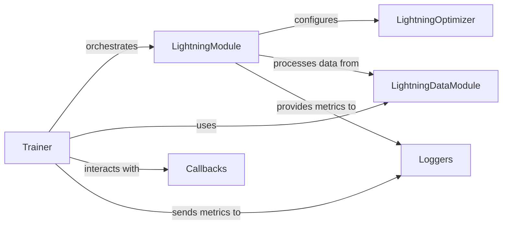

## Component Details

This subsystem focuses on the core components for defining a neural network model, managing its data, and handling its optimization within the PyTorch Lightning framework. The selected components are fundamental because they encapsulate the essential building blocks for any machine learning experiment: the model itself, the data pipeline, and the training mechanics.

### LightningModule
This is the central class where the neural network architecture, forward pass, and the core training, validation, test, and prediction steps are defined. It inherits from various hooks (`CheckpointHooks`, `DataHooks`, `ModelHooks`) and mixins (`_DeviceDtypeModuleMixin`, `HyperparametersMixin`), indicating its comprehensive responsibility for model logic, device and data type management, checkpointing, data handling, and hyperparameter management. It's fundamental as it provides a structured and opinionated way to organize all model-related logic, making models self-contained and reusable.

**Related Classes/Methods**:

- <a href="https://github.com/Lightning-AI/pytorch-lightning/blob/master/src/lightning/pytorch/core/module.py#L87-L1624" target="_blank" rel="noopener noreferrer">`lightning.pytorch.core.module.LightningModule` (87:1624)</a>

### LightningDataModule
This component encapsulates data loading, preprocessing, and splitting logic, providing standardized data loaders for training, validation, and testing. It inherits from `DataHooks` and `HyperparametersMixin`, highlighting its role in managing data-related hooks and hyperparameters. It's fundamental because it separates data concerns from model logic, promoting reusability and simplifying data pipeline management across different experiments or models.

**Related Classes/Methods**:

- <a href="https://github.com/Lightning-AI/pytorch-lightning/blob/master/src/lightning/pytorch/core/datamodule.py#L33-L318" target="_blank" rel="noopener noreferrer">`lightning.pytorch.core.datamodule.LightningDataModule` (33:318)</a>

### LightningOptimizer
This class wraps PyTorch optimizers, providing a standardized interface for optimization within the Lightning ecosystem. While its direct inheritance isn't deeply nested in the provided hierarchy, its role is crucial for managing the optimization process, including features like automatic optimization and optimizer scheduling. It's fundamental for abstracting optimizer complexities and enabling advanced optimization techniques.

**Related Classes/Methods**:

- <a href="https://github.com/Lightning-AI/pytorch-lightning/blob/master/src/lightning/pytorch/core/optimizer.py#L38-L170" target="_blank" rel="noopener noreferrer">`lightning.pytorch.core.optimizer.LightningOptimizer` (38:170)</a>

### Trainer
The `Trainer` is the orchestrator of the entire training, validation, testing, and prediction workflow. It manages the training loops, device placement, distributed training, logging, and checkpointing. Its extensive connections to various internal loops (`_FitLoop`, `_EvaluationLoop`, `_PredictionLoop`) and connectors (`_AcceleratorConnector`, `_CallbackConnector`, `_DataConnector`, `_LoggerConnector`) confirm its central role in driving the entire process. It's fundamental because it abstracts away the boilerplate code of the training loop, allowing users to focus on model and data definition.

**Related Classes/Methods**:

- <a href="https://github.com/Lightning-AI/pytorch-lightning/blob/master/src/lightning/pytorch/trainer/trainer.py#L88-L1726" target="_blank" rel="noopener noreferrer">`lightning.pytorch.trainer.trainer.Trainer` (88:1726)</a>

### Callbacks
`Callbacks` are a powerful mechanism to extend the `Trainer`'s functionality and inject custom logic at various stages of the training process (e.g., `on_train_start`, `on_epoch_end`). Many specific callbacks (e.g., `ModelCheckpoint`, `EarlyStopping`, `LearningRateMonitor`) inherit from the base `lightning.pytorch.callbacks.callback.Callback` class. They are fundamental for adding non-core, reusable functionalities like logging, checkpointing, early stopping, and model summary without modifying the `LightningModule` or `Trainer` directly.

**Related Classes/Methods**:

- <a href="https://github.com/Lightning-AI/pytorch-lightning/blob/master/src/lightning/pytorch/callbacks/callback.py#L24-L285" target="_blank" rel="noopener noreferrer">`lightning.pytorch.callbacks.callback.Callback` (24:285)</a>

### Loggers
`Loggers` are responsible for recording and visualizing metrics during training, validation, and testing. Various logger implementations (e.g., `CSVLogger`, `TensorBoardLogger`, `MLFlowLogger`) inherit from the base `lightning.pytorch.loggers.logger.Logger` class. They are fundamental for tracking experiment progress, debugging, and comparing different model runs by providing a standardized interface for metric collection and reporting.

**Related Classes/Methods**:

- <a href="https://github.com/Lightning-AI/pytorch-lightning/blob/master/src/lightning/pytorch/loggers/logger.py#L31-L47" target="_blank" rel="noopener noreferrer">`lightning.pytorch.loggers.logger.Logger` (31:47)</a>

### [FAQ](https://github.com/CodeBoarding/GeneratedOnBoardings/tree/main?tab=readme-ov-file#faq)