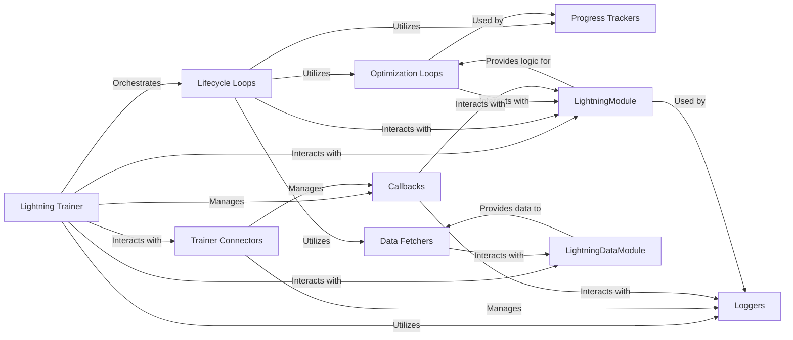

## Component Details

The `Lightning Trainer` subsystem is the core orchestration engine of PyTorch Lightning, managing the entire machine learning lifecycle from training to prediction. It provides a high-level abstraction over the complex details of distributed training, device management, and logging, allowing users to focus on model development.

### Lightning Trainer
The central orchestrator responsible for managing the entire training, validation, testing, and prediction lifecycle. It coordinates interactions between the model, data, callbacks, loggers, and various internal components to execute the core training, evaluation, and prediction loops.

**Related Classes/Methods**:

- <a href="https://github.com/Lightning-AI/pytorch-lightning/blob/master/src/lightning/pytorch/trainer/trainer.py#L88-L1726" target="_blank" rel="noopener noreferrer">`lightning.pytorch.trainer.trainer.Trainer` (88:1726)</a>

### Trainer Connectors
Internal components that facilitate the `Trainer`'s interaction with various subsystems like accelerators, callbacks, checkpoints, data, and loggers. They encapsulate the logic for setting up and managing these connections, promoting modularity within the `Trainer`.

**Related Classes/Methods**:

- <a href="https://github.com/Lightning-AI/pytorch-lightning/blob/master/src/lightning/pytorch/trainer/connectors/accelerator_connector.py#L74-L627" target="_blank" rel="noopener noreferrer">`lightning.pytorch.trainer.connectors.accelerator_connector._AcceleratorConnector` (74:627)</a>
- <a href="https://github.com/Lightning-AI/pytorch-lightning/blob/master/src/lightning/pytorch/trainer/connectors/callback_connector.py#L45-L243" target="_blank" rel="noopener noreferrer">`lightning.pytorch.trainer.connectors.callback_connector._CallbackConnector` (45:243)</a>
- <a href="https://github.com/Lightning-AI/pytorch-lightning/blob/master/src/lightning/pytorch/trainer/connectors/checkpoint_connector.py#L45-L557" target="_blank" rel="noopener noreferrer">`lightning.pytorch.trainer.connectors.checkpoint_connector._CheckpointConnector` (45:557)</a>
- <a href="https://github.com/Lightning-AI/pytorch-lightning/blob/master/src/lightning/pytorch/trainer/connectors/data_connector.py#L45-L225" target="_blank" rel="noopener noreferrer">`lightning.pytorch.trainer.connectors.data_connector._DataConnector` (45:225)</a>
- <a href="https://github.com/Lightning-AI/pytorch-lightning/blob/master/src/lightning/pytorch/trainer/connectors/logger_connector/logger_connector.py#L31-L262" target="_blank" rel="noopener noreferrer">`lightning.pytorch.trainer.connectors.logger_connector.logger_connector._LoggerConnector` (31:262)</a>
- <a href="https://github.com/Lightning-AI/pytorch-lightning/blob/master/src/lightning/pytorch/trainer/connectors/signal_connector.py#L38-L157" target="_blank" rel="noopener noreferrer">`lightning.pytorch.trainer.connectors.signal_connector._SignalConnector` (38:157)</a>

### Lifecycle Loops
The core iterative mechanisms that define the different phases of a Lightning run (training, validation, testing, prediction). They manage the flow of data, model forward/backward passes, and metric computation for their respective stages. This component represents the abstract base and its concrete implementations.

**Related Classes/Methods**:

- <a href="https://github.com/Lightning-AI/pytorch-lightning/blob/master/src/lightning/pytorch/loops/loop.py#L19-L104" target="_blank" rel="noopener noreferrer">`lightning.pytorch.loops.loop._Loop` (19:104)</a>
- <a href="https://github.com/Lightning-AI/pytorch-lightning/blob/master/src/lightning/pytorch/loops/fit_loop.py#L57-L528" target="_blank" rel="noopener noreferrer">`lightning.pytorch.loops.fit_loop._FitLoop` (57:528)</a>
- <a href="https://github.com/Lightning-AI/pytorch-lightning/blob/master/src/lightning/pytorch/loops/evaluation_loop.py#L56-L612" target="_blank" rel="noopener noreferrer">`lightning.pytorch.loops.evaluation_loop._EvaluationLoop` (56:612)</a>
- <a href="https://github.com/Lightning-AI/pytorch-lightning/blob/master/src/lightning/pytorch/loops/prediction_loop.py#L46-L403" target="_blank" rel="noopener noreferrer">`lightning.pytorch.loops.prediction_loop._PredictionLoop` (46:403)</a>
- <a href="https://github.com/Lightning-AI/pytorch-lightning/blob/master/src/lightning/pytorch/loops/training_epoch_loop.py#L49-L568" target="_blank" rel="noopener noreferrer">`lightning.pytorch.loops.training_epoch_loop._TrainingEpochLoop` (49:568)</a>

### Optimization Loops
Components responsible for managing the optimization process within the training loop. They handle both automatic and manual optimization strategies, including gradient accumulation, the backward pass, and optimizer steps, ensuring efficient model weight updates.

**Related Classes/Methods**:

- <a href="https://github.com/Lightning-AI/pytorch-lightning/blob/master/src/lightning/pytorch/loops/optimization/automatic.py#L152-L328" target="_blank" rel="noopener noreferrer">`lightning.pytorch.loops.optimization.automatic._AutomaticOptimization` (152:328)</a>
- <a href="https://github.com/Lightning-AI/pytorch-lightning/blob/master/src/lightning/pytorch/loops/optimization/manual.py#L70-L135" target="_blank" rel="noopener noreferrer">`lightning.pytorch.loops.optimization.manual._ManualOptimization` (70:135)</a>

### Data Fetchers
Modules that handle the efficient retrieval and preparation of data batches from DataLoaders. They ensure that data is provided to the model in an optimized manner during the various lifecycle loops.

**Related Classes/Methods**:

- <a href="https://github.com/Lightning-AI/pytorch-lightning/blob/master/src/lightning/pytorch/loops/fetchers.py#L28-L82" target="_blank" rel="noopener noreferrer">`lightning.pytorch.loops.fetchers._DataFetcher` (28:82)</a>
- <a href="https://github.com/Lightning-AI/pytorch-lightning/blob/master/src/lightning/pytorch/loops/fetchers.py#L145-L183" target="_blank" rel="noopener noreferrer">`lightning.pytorch.loops.fetchers._DataLoaderIterDataFetcher` (145:183)</a>
- <a href="https://github.com/Lightning-AI/pytorch-lightning/blob/master/src/lightning/pytorch/loops/fetchers.py#L85-L142" target="_blank" rel="noopener noreferrer">`lightning.pytorch.loops.fetchers._PrefetchDataFetcher` (85:142)</a>

### Progress Trackers
A set of classes and utilities that monitor and report the progress of training, evaluation, and prediction. They provide granular updates on various aspects, such as batch processing, optimization steps, and scheduler advancements, enhancing user feedback.

**Related Classes/Methods**:

- <a href="https://github.com/Lightning-AI/pytorch-lightning/blob/master/src/lightning/pytorch/loops/progress.py#L138-L197" target="_blank" rel="noopener noreferrer">`lightning.pytorch.loops.progress._Progress` (138:197)</a>
- <a href="https://github.com/Lightning-AI/pytorch-lightning/blob/master/src/lightning/pytorch/loops/progress.py#L201-L232" target="_blank" rel="noopener noreferrer">`lightning.pytorch.loops.progress._BatchProgress` (201:232)</a>
- <a href="https://github.com/Lightning-AI/pytorch-lightning/blob/master/src/lightning/pytorch/loops/progress.py#L284-L310" target="_blank" rel="noopener noreferrer">`lightning.pytorch.loops.progress._OptimizationProgress` (284:310)</a>
- <a href="https://github.com/Lightning-AI/pytorch-lightning/blob/master/src/lightning/pytorch/loops/progress.py#L252-L280" target="_blank" rel="noopener noreferrer">`lightning.pytorch.loops.progress._OptimizerProgress` (252:280)</a>
- <a href="https://github.com/Lightning-AI/pytorch-lightning/blob/master/src/lightning/pytorch/loops/progress.py#L236-L248" target="_blank" rel="noopener noreferrer">`lightning.pytorch.loops.progress._SchedulerProgress` (236:248)</a>

### Callbacks
A pluggable system that allows users to inject custom logic and interact with the `Trainer`'s lifecycle at various predefined points (e.g., start/end of training, epoch, batch). This includes functionalities like model checkpointing, early stopping, and learning rate monitoring.

**Related Classes/Methods**:

- <a href="https://github.com/Lightning-AI/pytorch-lightning/blob/master/src/lightning/pytorch/callbacks/callback.py#L24-L285" target="_blank" rel="noopener noreferrer">`lightning.pytorch.callbacks.callback.Callback` (24:285)</a>
- <a href="https://github.com/Lightning-AI/pytorch-lightning/blob/master/src/lightning/pytorch/callbacks/model_checkpoint.py#L49-L804" target="_blank" rel="noopener noreferrer">`lightning.pytorch.callbacks.model_checkpoint.ModelCheckpoint` (49:804)</a>
- <a href="https://github.com/Lightning-AI/pytorch-lightning/blob/master/src/lightning/pytorch/callbacks/early_stopping.py#L36-L272" target="_blank" rel="noopener noreferrer">`lightning.pytorch.callbacks.early_stopping.EarlyStopping` (36:272)</a>
- <a href="https://github.com/Lightning-AI/pytorch-lightning/blob/master/src/lightning/pytorch/callbacks/lr_monitor.py#L37-L363" target="_blank" rel="noopener noreferrer">`lightning.pytorch.callbacks.lr_monitor.LearningRateMonitor` (37:363)</a>
- <a href="https://github.com/Lightning-AI/pytorch-lightning/blob/master/src/lightning/pytorch/callbacks/progress/progress_bar.py#L22-L209" target="_blank" rel="noopener noreferrer">`lightning.pytorch.callbacks.progress.progress_bar.ProgressBar` (22:209)</a>
- <a href="https://github.com/Lightning-AI/pytorch-lightning/blob/master/src/lightning/pytorch/callbacks/finetuning.py#L42-L330" target="_blank" rel="noopener noreferrer">`lightning.pytorch.callbacks.finetuning.BaseFinetuning` (42:330)</a>
- <a href="https://github.com/Lightning-AI/pytorch-lightning/blob/master/src/lightning/pytorch/callbacks/model_summary.py#L38-L109" target="_blank" rel="noopener noreferrer">`lightning.pytorch.callbacks.model_summary.ModelSummary` (38:109)</a>

### Loggers
Components responsible for recording and visualizing experiment data, including hyperparameters, metrics, and model graphs. They provide a standardized interface for various logging backends (e.g., CSV, TensorBoard), enabling comprehensive experiment tracking.

**Related Classes/Methods**:

- <a href="https://github.com/Lightning-AI/pytorch-lightning/blob/master/src/lightning/pytorch/loggers/logger.py#L31-L47" target="_blank" rel="noopener noreferrer">`lightning.pytorch.loggers.logger.Logger` (31:47)</a>
- <a href="https://github.com/Lightning-AI/pytorch-lightning/blob/master/src/lightning/pytorch/loggers/csv_logs.py#L63-L162" target="_blank" rel="noopener noreferrer">`lightning.pytorch.loggers.csv_logs.CSVLogger` (63:162)</a>
- <a href="https://github.com/Lightning-AI/pytorch-lightning/blob/master/src/lightning/pytorch/loggers/tensorboard.py#L38-L261" target="_blank" rel="noopener noreferrer">`lightning.pytorch.loggers.tensorboard.TensorBoardLogger` (38:261)</a>

### LightningModule
The core user-defined component that encapsulates the model architecture, forward pass, training/validation/test/prediction steps, optimizers, and learning rate schedulers. It defines the computational graph and the logic for a single training/evaluation step.

**Related Classes/Methods**:

- <a href="https://github.com/Lightning-AI/pytorch-lightning/blob/master/src/lightning/pytorch/core/module.py#L87-L1624" target="_blank" rel="noopener noreferrer">`lightning.pytorch.core.module.LightningModule` (87:1624)</a>

### LightningDataModule
An optional but recommended component for organizing data-related logic, including data loading, preprocessing, and splitting into training, validation, and test sets. It provides `DataLoader` instances to the `Trainer`.

**Related Classes/Methods**:

- <a href="https://github.com/Lightning-AI/pytorch-lightning/blob/master/src/lightning/pytorch/core/datamodule.py#L33-L318" target="_blank" rel="noopener noreferrer">`lightning.pytorch.core.datamodule.LightningDataModule` (33:318)</a>

### [FAQ](https://github.com/CodeBoarding/GeneratedOnBoardings/tree/main?tab=readme-ov-file#faq)