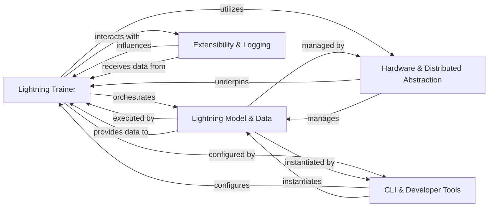

## Component Details

Final architecture overview for pytorch-lightning

### Lightning Trainer
The central orchestrator of the entire training, validation, testing, and prediction lifecycle. It manages the overall flow of a Lightning run, coordinating interactions between the model, data, and various plugins, and executing the core training loops.

**Related Classes/Methods**:

- <a href="https://github.com/Lightning-AI/pytorch-lightning/blob/master/src/lightning/pytorch/trainer/trainer.py#L88-L1726" target="_blank" rel="noopener noreferrer">`lightning.pytorch.trainer.trainer.Trainer` (88:1726)</a>
- <a href="https://github.com/Lightning-AI/pytorch-lightning/blob/master/src/lightning/fabric/plugins/environments/lightning.py#L1-L1" target="_blank" rel="noopener noreferrer">`lightning.pytorch.loops` (1:1)</a>

### Lightning Model & Data
Defines the neural network architecture, the forward pass, and the core training, validation, test, and prediction steps (`LightningModule`). It also encapsulates data loading, preprocessing, and splitting logic, providing standardized data loaders (`LightningDataModule`). This component includes the `LightningOptimizer` which wraps PyTorch optimizers.

**Related Classes/Methods**:

- <a href="https://github.com/Lightning-AI/pytorch-lightning/blob/master/src/lightning/pytorch/core/module.py#L87-L1624" target="_blank" rel="noopener noreferrer">`lightning.pytorch.core.module.LightningModule` (87:1624)</a>
- <a href="https://github.com/Lightning-AI/pytorch-lightning/blob/master/src/lightning/pytorch/core/datamodule.py#L33-L318" target="_blank" rel="noopener noreferrer">`lightning.pytorch.core.datamodule.LightningDataModule` (33:318)</a>
- <a href="https://github.com/Lightning-AI/pytorch-lightning/blob/master/src/lightning/pytorch/core/optimizer.py#L38-L170" target="_blank" rel="noopener noreferrer">`lightning.pytorch.core.optimizer.LightningOptimizer` (38:170)</a>

### Hardware & Distributed Abstraction
Provides the foundational layer (`Fabric`) for distributed training primitives, device management, and low-level training loops. It includes `Strategies` for distributed training paradigms, `Accelerators` for hardware-specific operations, and various `Plugins` (precision, checkpoint I/O, environment detection) to extend its capabilities.

**Related Classes/Methods**:

- <a href="https://github.com/Lightning-AI/pytorch-lightning/blob/master/src/lightning/fabric/fabric.py#L81-L1060" target="_blank" rel="noopener noreferrer">`lightning.fabric.fabric.Fabric` (81:1060)</a>
- <a href="https://github.com/Lightning-AI/pytorch-lightning/blob/master/src/lightning/fabric/plugins/environments/lightning.py#L1-L1" target="_blank" rel="noopener noreferrer">`lightning.fabric.strategies` (1:1)</a>
- <a href="https://github.com/Lightning-AI/pytorch-lightning/blob/master/src/lightning/fabric/plugins/environments/lightning.py#L1-L1" target="_blank" rel="noopener noreferrer">`lightning.pytorch.strategies` (1:1)</a>
- <a href="https://github.com/Lightning-AI/pytorch-lightning/blob/master/src/lightning/fabric/plugins/environments/lightning.py#L1-L1" target="_blank" rel="noopener noreferrer">`lightning.fabric.accelerators` (1:1)</a>
- <a href="https://github.com/Lightning-AI/pytorch-lightning/blob/master/src/lightning/fabric/plugins/environments/lightning.py#L1-L1" target="_blank" rel="noopener noreferrer">`lightning.pytorch.accelerators` (1:1)</a>
- `lightning.fabric.plugins.precision` (1:1)
- `lightning.pytorch.plugins.precision` (1:1)
- `lightning.fabric.plugins.io` (1:1)
- `lightning.pytorch.plugins.io` (1:1)
- `lightning.fabric.plugins.environments` (1:1)

### Extensibility & Logging
Offers a flexible system of `Callbacks` to hook into the training process at various events for auxiliary tasks (e.g., early stopping, checkpointing). It also integrates with various `Loggers` for experiment tracking, recording, and visualizing metrics and hyperparameters.

**Related Classes/Methods**:

- <a href="https://github.com/Lightning-AI/pytorch-lightning/blob/master/src/lightning/fabric/plugins/environments/lightning.py#L1-L1" target="_blank" rel="noopener noreferrer">`lightning.pytorch.callbacks` (1:1)</a>
- <a href="https://github.com/Lightning-AI/pytorch-lightning/blob/master/src/lightning/fabric/plugins/environments/lightning.py#L1-L1" target="_blank" rel="noopener noreferrer">`lightning.pytorch.loggers` (1:1)</a>

### CLI & Developer Tools
Provides a powerful `LightningCLI` for configuring and running Lightning experiments from the command line. It also includes `Tuner` utilities for hyperparameter optimization (e.g., learning rate finder) and `Profilers` for performance analysis.

**Related Classes/Methods**:

- <a href="https://github.com/Lightning-AI/pytorch-lightning/blob/master/src/lightning/pytorch/cli.py#L310-L755" target="_blank" rel="noopener noreferrer">`lightning.pytorch.cli.LightningCLI` (310:755)</a>
- <a href="https://github.com/Lightning-AI/pytorch-lightning/blob/master/src/lightning/pytorch/tuner/tuning.py#L24-L183" target="_blank" rel="noopener noreferrer">`lightning.pytorch.tuner.tuning.Tuner` (24:183)</a>
- <a href="https://github.com/Lightning-AI/pytorch-lightning/blob/master/src/lightning/fabric/plugins/environments/lightning.py#L1-L1" target="_blank" rel="noopener noreferrer">`lightning.pytorch.profilers` (1:1)</a>

### [FAQ](https://github.com/CodeBoarding/GeneratedOnBoardings/tree/main?tab=readme-ov-file#faq)