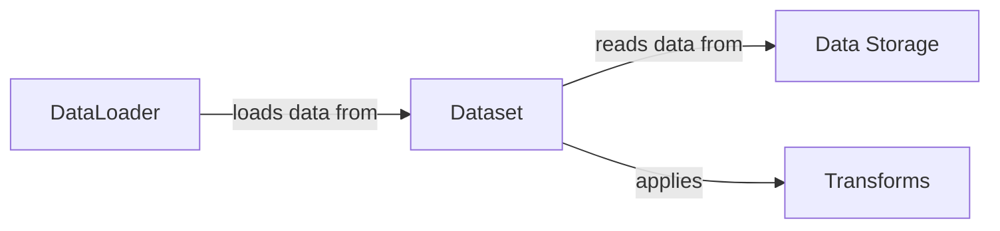

## Component Details

The Data Management component is responsible for handling the entire data pipeline, from accessing raw data to providing processed and batched data ready for model training and evaluation. It encompasses data loading, preprocessing, and batching, abstracting away the complexities of data acquisition and transformation. The component ensures data is in the correct format and structure for efficient training, and it provides a consistent interface for feeding data to the model.

### Dataset
The Dataset component stores samples and their corresponding labels. It inherits from `torch.utils.data.Dataset` and overrides the `__len__` and `__getitem__` methods to provide access to individual data samples. It reads data from Data Storage and applies Transforms to each sample before returning it.
- **Related Classes/Methods**: `torch.utils.data.Dataset`, `custom_dataset.py`, `datasets.py`

### DataLoader
The DataLoader component wraps an iterable around the Dataset to enable easy access to the samples. It automates batching, shuffling, and data loading in parallel using multiprocessing. It loads data from the Dataset and provides it in batches for training, optimizing data flow to the model.
- **Related Classes/Methods**: `torch.utils.data.DataLoader`, `data_loader.py`

### Transforms
The Transforms component is responsible for preprocessing the data before feeding it to the model. Common transforms include scaling, normalization, and data augmentation. These transformations are applied to the data samples within the Dataset to improve model performance and generalization.
- **Related Classes/Methods**: `torchvision.transforms`, `custom_transforms.py`, `transforms.py`

### Data Storage
The Data Storage component represents the location where the raw data is stored, such as image files, CSV files, or databases. The Dataset component reads the data from this storage, providing the initial data source for the entire pipeline.
- **Related Classes/Methods**: `data/images`, `data/data.csv`
