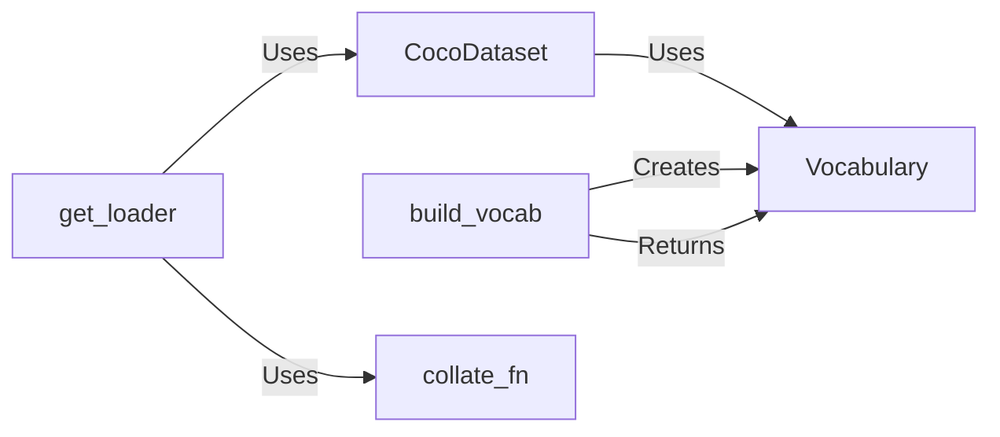

## Component Details

### CocoDataset
The CocoDataset class is responsible for loading and preprocessing the COCO dataset. It inherits from `torch.utils.data.Dataset` and uses the `pycocotools` library to parse the COCO annotations file. It loads images and captions, preprocesses them, and provides data pairs (image, caption) for training the image captioning model. The dataset also utilizes a vocabulary wrapper to map words to their corresponding indices.
- **Related Classes/Methods**: `data_loader.py`

### Vocabulary
The Vocabulary class creates a mapping between words and their corresponding indices. It provides methods to add words to the vocabulary and retrieve the index of a word. It also handles unknown words by returning the index of the '<unk>' token. This class is essential for converting text captions into numerical data that can be processed by the model.
- **Related Classes/Methods**: `build_vocab.py`

### build_vocab
The `build_vocab` function builds the vocabulary from the COCO annotation file based on a given threshold. It uses `pycocotools.coco.COCO` to parse the annotation file, tokenizes the captions using `nltk.tokenize.word_tokenize`, and counts the word frequencies. It then creates a `Vocabulary` instance and adds the words that meet the threshold to the vocabulary.
- **Related Classes/Methods**: `build_vocab.py`

### get_loader
The `get_loader` function creates and returns a `torch.utils.data.DataLoader` instance for the COCO dataset. It instantiates the `CocoDataset` and configures the `DataLoader` with the dataset, batch size, shuffle option, number of workers, and the custom `collate_fn`. This function simplifies the process of creating data loaders for training and validation.
- **Related Classes/Methods**: `data_loader.py`

### collate_fn
The `collate_fn` is a custom collate function that creates mini-batches of data, including padding captions to the same length within a batch. It sorts the data by caption length and merges images and captions into tensors. This function is necessary because the default collate function does not support merging captions with padding.
- **Related Classes/Methods**: `data_loader.py`
