```mermaid
graph LR
    Test_Data_Loader["Test Data Loader"]
    Model_Evaluation_Mode["Model Evaluation Mode"]
    Disable_Gradient_Calculation["Disable Gradient Calculation"]
    Input_Reshaping["Input Reshaping"]
    Model_Prediction["Model Prediction"]
    Prediction_Decoding["Prediction Decoding"]
    Correct_Prediction_Counter["Correct Prediction Counter"]
    Total_Sample_Counter["Total Sample Counter"]
    Accuracy_Reporting["Accuracy Reporting"]
    Test_Data_Loader -- "loads data into" --> Input_Reshaping
    Model_Evaluation_Mode -- "sets the mode for" --> Disable_Gradient_Calculation
    Disable_Gradient_Calculation -- "executes within" --> Model_Prediction
    Input_Reshaping -- "reshapes the" --> Model_Prediction
    Model_Prediction -- "generates output for" --> Prediction_Decoding
    Prediction_Decoding -- "compares predictions in" --> Correct_Prediction_Counter
    Prediction_Decoding -- "accumulates total samples in" --> Total_Sample_Counter
    Correct_Prediction_Counter -- "reports results from" --> Accuracy_Reporting
    Total_Sample_Counter -- "reports results from" --> Accuracy_Reporting
```

## Component Details

The evaluation component assesses the performance of a trained model using a test dataset. It iterates through the dataset, makes predictions with the model, compares these predictions to the actual labels, and calculates overall accuracy. The process involves setting the model to evaluation mode, disabling gradient calculations for efficiency, reshaping input data for compatibility with the model, and accumulating correct predictions and total samples to compute the final test accuracy.

### Test Data Loader
Loads the test dataset in batches for processing. It uses `torch.utils.data.DataLoader` to efficiently manage the data loading process, ensuring that the data is fed into the model in manageable chunks.
- **Related Classes/Methods**: `evaluate.py`

### Model Evaluation Mode
Sets the model to evaluation mode using `model.eval()`. This is crucial for disabling training-specific features like dropout and batch normalization, ensuring consistent and reliable predictions during evaluation.
- **Related Classes/Methods**: `evaluate.py`

### Disable Gradient Calculation
Disables gradient calculation using `torch.no_grad()` context. This significantly reduces memory consumption and speeds up the evaluation process, as gradients are not needed during inference.
- **Related Classes/Methods**: `evaluate.py`

### Input Reshaping
Reshapes the input images to the correct dimensions expected by the RNN model. This ensures that the data is in the appropriate format (batch_size, sequence_length, input_size) for processing by the model.
- **Related Classes/Methods**: `evaluate.py`

### Model Prediction
Performs the forward pass of the RNN model to generate predictions. The reshaped input images are fed into the model, and the output represents the predicted class probabilities.
- **Related Classes/Methods**: `evaluate.py`

### Prediction Decoding
Decodes the model's output to determine the predicted class labels. It selects the class with the highest probability as the predicted class using `torch.max`.
- **Related Classes/Methods**: `evaluate.py`

### Correct Prediction Counter
Counts the number of correctly predicted labels by comparing the predicted labels with the ground truth labels. This is done by summing the number of instances where the predicted label matches the true label.
- **Related Classes/Methods**: `evaluate.py`

### Total Sample Counter
Accumulates the total number of test samples processed. This is used to calculate the overall accuracy of the model.
- **Related Classes/Methods**: `evaluate.py`

### Accuracy Reporting
Prints the final test accuracy of the model. The accuracy is calculated as the percentage of correctly predicted labels out of the total number of test samples.
- **Related Classes/Methods**: `evaluate.py`
