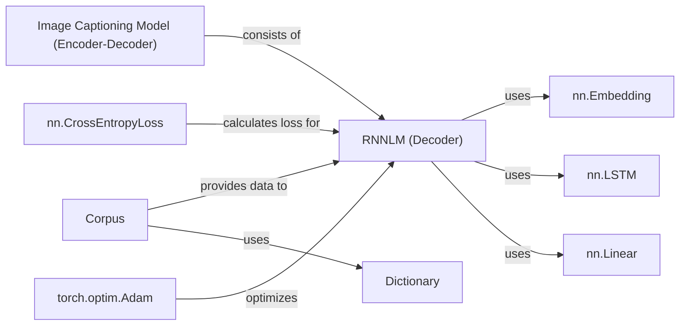

## Component Details

### Image Captioning Model (Encoder-Decoder)
This component defines the overall architecture for generating image captions. It consists of an encoder (typically a CNN like ResNet) that processes the input image and a decoder (typically an LSTM) that generates the caption based on the encoded image representation. The encoder extracts features from the image, and the decoder uses these features to generate a textual description.
- **Related Classes/Methods**: `model.py`

### RNNLM (Decoder)
The RNNLM (Recurrent Neural Network Language Model) acts as the decoder in the image captioning model. It takes the encoded image features as input and generates the caption word by word. It consists of an embedding layer, an LSTM layer, and a linear layer for language modeling. The forward method takes input `x` (word IDs) and hidden state `h`, embeds the words, propagates through the LSTM, reshapes the output, and decodes the hidden states to predict the next word.
- **Related Classes/Methods**: `model.py`

### nn.Embedding
This PyTorch embedding layer converts word IDs into dense vector representations. It's a lookup table that maps each word in the vocabulary to a corresponding vector. This layer is used within the RNNLM to convert input word indices into dense vector representations, enabling the LSTM to process the text.
- **Related Classes/Methods**: `model.py`

### nn.LSTM
This PyTorch LSTM layer processes the embedded word vectors and maintains hidden states. It captures the sequential dependencies in the text. The LSTM takes the sequence of word embeddings as input and updates its hidden state at each time step, allowing it to remember information from previous words and use it to predict the next word.
- **Related Classes/Methods**: `model.py`

### nn.Linear
This PyTorch linear layer maps the hidden states to the vocabulary size. It transforms the LSTM's hidden state into a probability distribution over the vocabulary, predicting the next word. The output of this layer is then used to calculate the loss and update the model's parameters.
- **Related Classes/Methods**: `model.py`

### Corpus
The Corpus component loads and preprocesses the data, creating a vocabulary and converting text to numerical IDs. It reads the training data from a file, builds a dictionary of words, and converts the text into a sequence of numerical IDs, which are then used as input to the RNNLM. This component prepares the data for training the language model.
- **Related Classes/Methods**: `data_utils.py`

### Dictionary
The Dictionary component creates a mapping between words and their corresponding IDs. It maintains two dictionaries: `word2idx` (word to index) and `idx2word` (index to word), allowing for efficient conversion between words and their numerical representations. This component is used by the Corpus to convert text into numerical data.
- **Related Classes/Methods**: `data_utils.py`

### nn.CrossEntropyLoss
This PyTorch loss function calculates the cross-entropy loss between the predicted output and the target. It measures the difference between the predicted probability distribution over the vocabulary and the actual next word, guiding the training process. The goal is to minimize this loss, which indicates that the model is accurately predicting the next word.
- **Related Classes/Methods**: `model.py`

### torch.optim.Adam
This PyTorch optimizer updates the model's parameters to minimize the loss. It adjusts the weights of the RNNLM based on the gradients of the loss function, iteratively improving the model's performance. Adam is a popular optimization algorithm that adapts the learning rate for each parameter, leading to faster convergence.
- **Related Classes/Methods**: `model.py`
