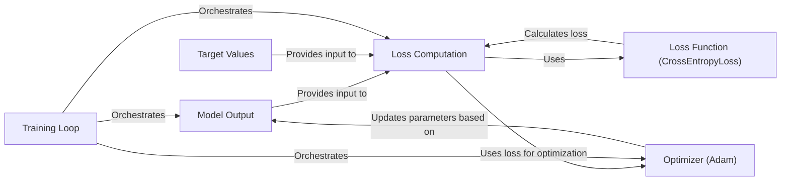

## Component Details

The loss computation process is central to training a neural network. It begins with the model generating an output based on input data. This output, along with the corresponding target values, is fed into a loss function, such as CrossEntropyLoss, which quantifies the discrepancy between the prediction and the ground truth. The resulting loss value serves as a crucial signal for the optimizer, guiding the adjustment of the model's parameters during the training loop. The optimizer uses the gradients of the loss function with respect to the model's parameters to update the parameters, aiming to minimize the loss and improve the model's accuracy.

### Model Output
Represents the output of the neural network model after processing the input data. It's a tensor containing predicted values.
- **Related Classes/Methods**: `model.py`

### Target Values
Represents the ground truth or desired output for the given input data. These values are used to compare against the model's predictions.
- **Related Classes/Methods**: `data.py`

### Loss Function (CrossEntropyLoss)
A specific loss function used to quantify the difference between the model's predictions and the target values. CrossEntropyLoss is suitable for classification tasks.
- **Related Classes/Methods**: `loss.py`

### Loss Computation
Calculates the loss value by comparing the model output and target values using the selected loss function. This component orchestrates the process of feeding the model output and target values into the loss function and obtaining the resulting loss value.
- **Related Classes/Methods**: `loss.py`

### Optimizer (Adam)
The optimization algorithm used to update the model's parameters based on the calculated loss. Adam is a popular optimization algorithm that adapts the learning rate for each parameter.
- **Related Classes/Methods**: `loss.py`

### Training Loop
Iterates through the training dataset, performs forward and backward passes, and updates the model's parameters using the optimizer. This component orchestrates the entire training process.
- **Related Classes/Methods**: `loss.py`
