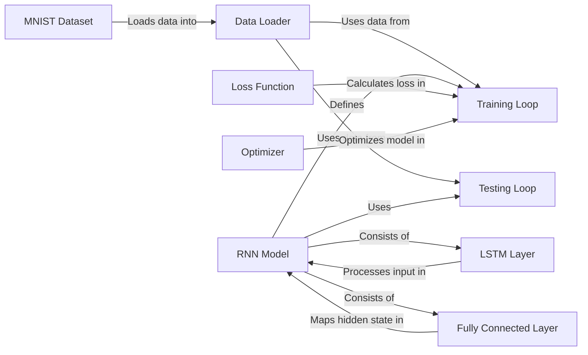

## Component Details

The model architecture defines the structure and behavior of the neural network used for image classification. It consists of an RNN model with LSTM and fully connected layers. The training loop iterates through the dataset, optimizing the model using a loss function and optimizer. The testing loop evaluates the model's performance on a separate dataset.

### MNIST Dataset
Loads the MNIST dataset for training and testing. It downloads the dataset if it's not already present and applies a transformation to convert the images to tensors.
- **Related Classes/Methods**: `main.py`

### Data Loader
Creates data loaders for the training and testing datasets. These loaders handle batching, shuffling, and parallel loading of the data.
- **Related Classes/Methods**: `main.py`

### RNN Model
Defines the recurrent neural network model. It consists of an LSTM layer and a fully connected layer. The LSTM layer processes the input sequence, and the fully connected layer maps the hidden state to the output classes.
- **Related Classes/Methods**: `main.py`

### LSTM Layer
The LSTM layer processes the input sequence and learns temporal dependencies. It takes the input sequence and hidden state as input and outputs the hidden state and cell state at each time step.
- **Related Classes/Methods**: `main.py`

### Fully Connected Layer
The fully connected layer maps the hidden state from the LSTM layer to the output classes. It takes the hidden state as input and outputs the predicted class probabilities.
- **Related Classes/Methods**: `main.py`

### Loss Function
Defines the loss function used for training the model. Cross-entropy loss is suitable for multi-class classification problems.
- **Related Classes/Methods**: `main.py`

### Optimizer
Defines the optimizer used for training the model. Adam is a popular optimization algorithm that adapts the learning rate for each parameter.
- **Related Classes/Methods**: `main.py`

### Training Loop
Iterates through the training dataset, performs forward and backward passes, and updates the model parameters using the optimizer.
- **Related Classes/Methods**: `main.py`

### Testing Loop
Evaluates the trained model on the test dataset. It calculates the accuracy of the model by comparing the predicted labels with the true labels.
- **Related Classes/Methods**: `main.py`
