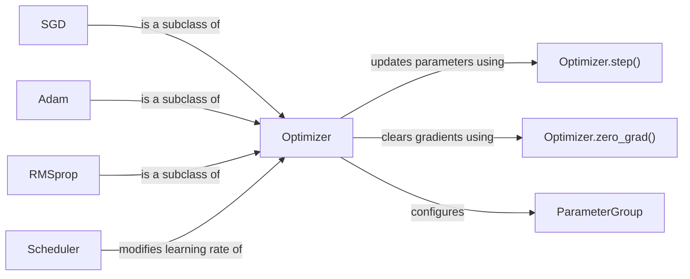

## Component Details

The Optimization Algorithms component in PyTorch provides a suite of algorithms to update model parameters during training, aiming to minimize the loss function. It includes various optimization methods like SGD, Adam, and RMSprop, each with its own approach to updating parameters based on gradients. The core functionality revolves around calculating and applying parameter updates, managing learning rates, and handling parameter groups with specific optimization settings. Schedulers are used to dynamically adjust learning rates during training.

### Optimizer
The base class for all optimizers in PyTorch. It provides a common interface for adding parameters to optimize, setting learning rates, and updating parameters based on gradients. It defines the `step()` method for performing a single optimization step and the `zero_grad()` method for clearing the gradients of the optimized parameters.
- **Related Classes/Methods**: `torch.optim.optimizer.Optimizer`

### SGD
Implements stochastic gradient descent (optionally with momentum). It updates parameters by moving them in the opposite direction of the gradient of the loss function with respect to the parameters. It's a basic and widely used optimization algorithm.
- **Related Classes/Methods**: `torch.optim.sgd.SGD`

### Adam
Implements the Adam algorithm, a popular optimization algorithm that adapts the learning rates for each parameter based on estimates of the first and second moments of the gradients. It's known for its efficiency and good performance in many deep learning tasks.
- **Related Classes/Methods**: `torch.optim.adam.Adam`

### RMSprop
Implements the RMSprop algorithm, another adaptive learning rate optimization algorithm that uses a moving average of squared gradients to normalize the learning rate. It's similar to Adam but uses a different approach for adapting the learning rates.
- **Related Classes/Methods**: `torch.optim.rmsprop.RMSprop`

### Optimizer.step()
Performs a single optimization step (parameter update). It updates the parameters of the model based on the gradients computed during the backward pass.
- **Related Classes/Methods**: `torch.optim.optimizer.Optimizer.step`

### Optimizer.zero_grad()
Clears the gradients of all optimized parameters. It's called before the backward pass to reset the gradients to zero, preventing accumulation of gradients from previous iterations.
- **Related Classes/Methods**: `torch.optim.optimizer.Optimizer.zero_grad`

### Scheduler
Provides several ways to adjust the learning rate based on the number of epochs or other criteria. Scheduler objects are used to schedule the values of the learning rate based on the number of epochs. Common schedulers include StepLR, MultiStepLR, and ReduceLROnPlateau.
- **Related Classes/Methods**: `torch.optim.lr_scheduler`

### ParameterGroup
Represents a group of parameters with specific optimization options. Optimizers can be configured with multiple parameter groups, each with its own learning rate and other hyperparameters.
- **Related Classes/Methods**: `torch.optim.optimizer.Optimizer`
