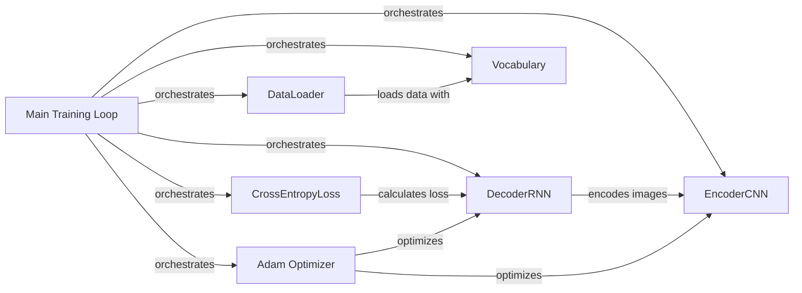

## Component Details

### Main Training Loop
The main function that orchestrates the training process. It initializes the data loader, builds the encoder and decoder models, defines the loss function and optimizer, and then runs the training loop, iterating through epochs and batches of data. It also saves model checkpoints periodically.
- **Related Classes/Methods**: `train.py`

### EncoderCNN
The CNN encoder that extracts image features using a pretrained ResNet. It takes an image as input and outputs a feature vector. Includes a linear layer and batch normalization.
- **Related Classes/Methods**: `model.py`

### DecoderRNN
The RNN decoder that generates captions from the image features. It takes the image features and captions as input and outputs the predicted captions. Uses an LSTM to generate the caption.
- **Related Classes/Methods**: `model.py`

### DataLoader
The data loader that loads the image and caption data in batches. It also applies the necessary preprocessing steps, such as resizing, normalization, and tokenization. It uses a custom collate function to handle variable length captions.
- **Related Classes/Methods**: `data_loader.py`

### Vocabulary
The vocabulary wrapper that maps words to indices and vice versa. It provides a way to convert text captions into numerical data that can be processed by the model.
- **Related Classes/Methods**: `build_vocab.py`

### CrossEntropyLoss
The cross-entropy loss function that measures the difference between the predicted and target captions. It is used to train the model to generate accurate captions.
- **Related Classes/Methods**: `torch.nn`

### Adam Optimizer
The Adam optimizer that updates the model parameters during training. It is used to minimize the loss function and improve the model's performance.
- **Related Classes/Methods**: `torch.optim`
