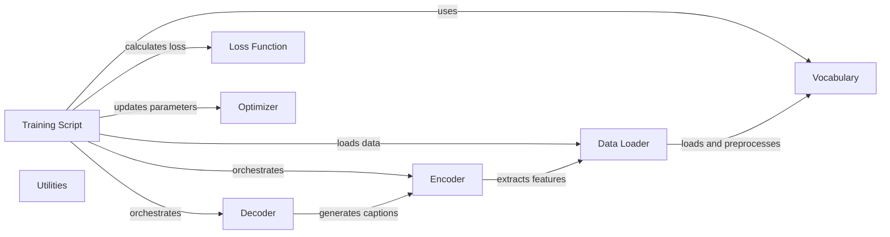

## Component Details

The training orchestration component manages the entire training loop of the image captioning model. It encompasses data loading, model initialization, forward and backward passes, loss calculation, parameter updates, and model saving. The core of this component lies within the `train.py` script, which coordinates the interactions between the data loader, model (encoder and decoder), loss function, and optimizer. It ensures the model learns to generate accurate captions for images by iteratively refining its parameters based on the training data.

### Training Script
The main script (`train.py`) that orchestrates the training process. It handles argument parsing, data loading, model initialization, training loop execution, and saving the trained model.
- **Related Classes/Methods**: `train.py`

### Encoder
The encoder part of the model (`model.py`), responsible for extracting features from the input images. It typically uses a convolutional neural network (CNN).
- **Related Classes/Methods**: `model.py`

### Decoder
The decoder part of the model (`model.py`), responsible for generating captions based on the features extracted by the encoder. It typically uses a recurrent neural network (RNN).
- **Related Classes/Methods**: `model.py`

### Data Loader
Loads and preprocesses the training data, including images and captions (`data_loader.py`). It also handles batching and shuffling of the data.
- **Related Classes/Methods**: `data_loader.py`

### Vocabulary
Creates and manages the vocabulary, which maps words to numerical indices (`build_vocab.py`). It is used to convert captions into numerical data that can be processed by the model.
- **Related Classes/Methods**: `build_vocab.py`

### Loss Function
Calculates the loss between the model's predictions and the ground truth captions. It quantifies the error of the model. The loss function is defined and used within `train.py`.
- **Related Classes/Methods**: `train.py`

### Optimizer
Updates the model's parameters based on the gradients of the loss function. It implements the optimization algorithm. The optimizer is initialized and used within `train.py`.
- **Related Classes/Methods**: `train.py`

### Utilities
Contains utility functions such as creating dictionary (`utils.py`).
- **Related Classes/Methods**: `utils.py`
