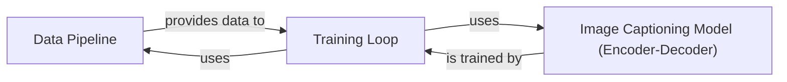

## Component Details

### Data Pipeline
This component is responsible for loading, preprocessing, and batching the COCO dataset. It builds a vocabulary, tokenizes captions, and creates data loaders for training and validation, ensuring the data is in the correct format for the image captioning model.
- **Related Classes/Methods**: `data_loader.py`, `build_vocab.py`

### Image Captioning Model (Encoder-Decoder)
This component defines the architecture for generating image captions. It consists of an encoder (typically a CNN like ResNet) that processes the input image and a decoder (typically an LSTM) that generates the caption based on the encoded image representation.
- **Related Classes/Methods**: `model.py`

### Training Loop
This component manages the training process of the image captioning model. It iterates through the data provided by the Data Pipeline, feeds it to the Image Captioning Model, calculates the loss, and updates the model's parameters using an optimizer to improve performance.
- **Related Classes/Methods**: `train.py`