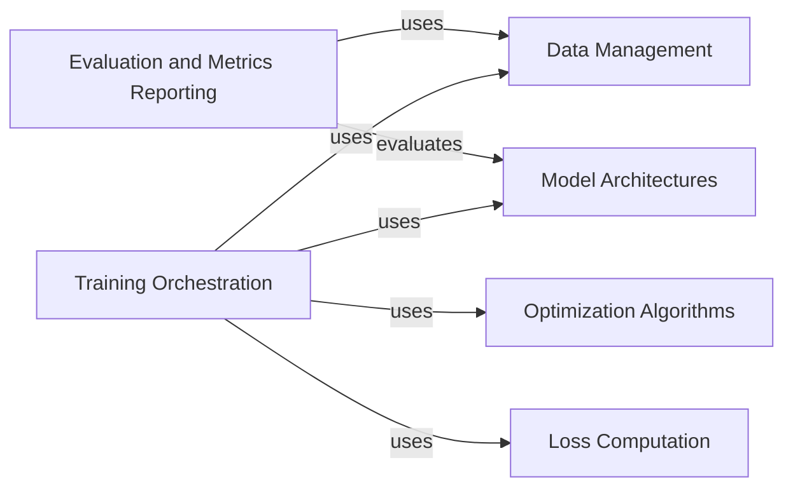

## Component Details

The PyTorch Tutorial project demonstrates fundamental deep learning concepts using PyTorch. It encompasses data handling, model definition, training orchestration, optimization, loss computation, and evaluation. The core flow involves loading and preprocessing data, defining a neural network model, training the model using an optimization algorithm and a loss function, and finally evaluating the model's performance using appropriate metrics.

### Data Management
This component handles the loading, preprocessing, and batching of data for training and evaluation. It abstracts away the complexities of data acquisition and transformation, providing a consistent interface for feeding data to the model. It ensures that the data is in the correct format and structure for efficient training.
- **Related Classes/Methods**: `data_loader.py`, `datasets.py`, `transforms.py`

### Model Architectures
This component defines the structure and behavior of the neural network models used in the project. It encapsulates the layers, activation functions, and other parameters that define the model's architecture. It provides a modular and reusable way to define different model types, such as CNNs, MLPs, and RNNs.
- **Related Classes/Methods**: `models/cnn.py`, `models/mlp.py`, `models/rnn.py`

### Training Orchestration
This component manages the training loop, coordinating the forward and backward passes, loss calculation, and parameter updates. It encapsulates the core logic of the training process, allowing for easy experimentation with different training configurations. It ensures that the model is trained effectively and efficiently.
- **Related Classes/Methods**: `train.py`, `utils.py`

### Optimization Algorithms
This component provides a collection of optimization algorithms used to update the model's parameters during training. It encapsulates the logic of different optimization methods, such as SGD, Adam, and others, allowing for easy selection and configuration. It ensures that the model's parameters are updated in a way that minimizes the loss function.
- **Related Classes/Methods**: `optimizers.py`

### Loss Computation
This component defines the loss functions used to measure the difference between the model's predictions and the ground truth labels. It encapsulates the logic of different loss functions, allowing for easy selection and configuration based on the specific task and model architecture. It provides a way to quantify the model's performance and guide the training process.
- **Related Classes/Methods**: `loss.py`

### Evaluation and Metrics Reporting
This component evaluates the performance of the trained model on a validation or test dataset. It calculates relevant metrics such as accuracy, precision, and recall, and reports the results. It provides a way to assess the model's generalization ability and compare different models.
- **Related Classes/Methods**: `evaluate.py`, `metrics.py`