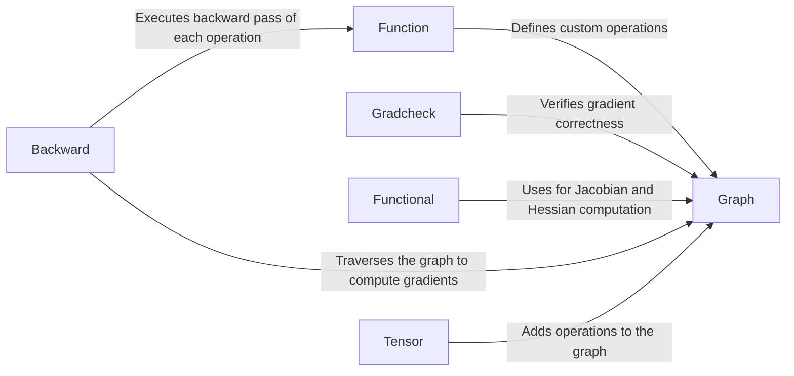

## Component Details

The `torch.autograd` component is the automatic differentiation engine of PyTorch. It dynamically constructs a computational graph representing operations performed on tensors, enabling the computation of gradients via backpropagation. This is crucial for training neural networks, as it automates the process of calculating derivatives of the loss function with respect to model parameters. The core functionality involves tracking operations, building the graph, and efficiently computing gradients using the chain rule.

### Function
The `Function` class serves as a base class for defining custom autograd operations. Users can extend this class to implement custom forward and backward passes, thereby extending PyTorch's autograd engine with user-defined operations. It is a crucial part of the autograd system, allowing users to define how gradients are computed for their custom operations.
- **Related Classes/Methods**: `torch.autograd.function`

### Graph
The `Graph` component manages the dynamic computational graph that tracks operations performed on tensors. It is responsible for creating, maintaining, and manipulating the graph structure, which is essential for backpropagation. The graph represents the flow of computations, enabling the autograd engine to trace operations and compute gradients efficiently.
- **Related Classes/Methods**: `torch.autograd.graph`

### Gradcheck
The `Gradcheck` component provides utilities for verifying the correctness of gradients computed by the autograd engine. It numerically approximates gradients and compares them to the analytically computed gradients, ensuring that the backward pass is implemented correctly. This is crucial for debugging and ensuring the reliability of custom autograd functions.
- **Related Classes/Methods**: `torch.autograd.gradcheck`

### Functional
The `Functional` component offers functional interfaces for computing Jacobians and Hessians using autograd. These functions provide a higher-level API for computing higher-order derivatives, which can be useful for various applications like optimization and sensitivity analysis. It leverages the autograd engine to compute these higher-order derivatives efficiently.
- **Related Classes/Methods**: `torch.autograd.functional`

### Backward
The `Backward` component implements the backward pass, computing gradients of the loss with respect to the parameters. It traverses the computation graph in reverse order, applying the chain rule to compute gradients for each operation. This is the core of the autograd engine, enabling the efficient computation of gradients for training neural networks.
- **Related Classes/Methods**: `torch.autograd.backward`

### Tensor
The `Tensor` component extends the `torch.Tensor` class to enable autograd tracking. When `requires_grad=True`, operations on the tensor are tracked in the computation graph. This allows the autograd engine to automatically compute gradients for operations involving these tensors, making it a fundamental part of the autograd system.
- **Related Classes/Methods**: `torch.autograd.tensor`
