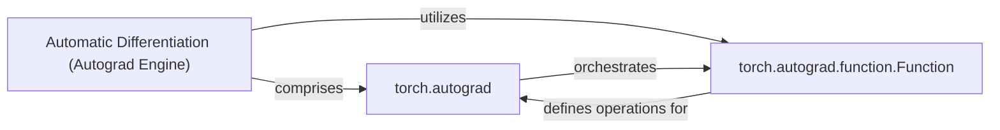

## Details

The PyTorch Automatic Differentiation (Autograd) Engine is the core mechanism enabling gradient computation for tensor operations. It dynamically constructs a computational graph (the "tape") by recording operations performed on tensors with `requires_grad=True`. The `torch.autograd` package acts as the central orchestrator, managing this graph and coordinating the backward pass. Key to its extensibility is `torch.autograd.function.Function`, an abstract base class that allows users and internal operations to define custom forward and backward computations, thereby integrating seamlessly into the autograd system.

### Automatic Differentiation (Autograd Engine) [[Expand]](./Automatic_Differentiation_Autograd_Engine_.md)
The overarching core engine that records operations on tensors to build a dynamic computational graph (the "tape") and automatically computes gradients during the backward pass. This engine is fundamental to PyTorch's imperative and flexible design, allowing for dynamic graph construction during runtime.

**Related Classes/Methods**:

- <a href="https://github.com/pytorch/pytorch/blob/main/torch/autograd/__init__.py" target="_blank" rel="noopener noreferrer">`torch.autograd`</a>

### torch.autograd
This top-level package serves as the orchestrator for the entire automatic differentiation process. It manages the dynamic computational graph, tracks operations performed on tensors, and coordinates the backward pass to compute and propagate gradients. It provides the public API for autograd functionalities.

**Related Classes/Methods**:

- <a href="https://github.com/pytorch/pytorch/blob/main/torch/autograd/__init__.py" target="_blank" rel="noopener noreferrer">`torch.autograd`</a>

### torch.autograd.function.Function
This is the foundational abstract base class for defining custom differentiable operations in PyTorch. It provides the interface for users and internal PyTorch operations to specify both the forward computation and its corresponding backward gradient computation, allowing for extensibility of the autograd system.

**Related Classes/Methods**:

- <a href="https://github.com/pytorch/pytorch/blob/main/torch/autograd/function.py#L470-L595" target="_blank" rel="noopener noreferrer">`torch.autograd.function.Function`:470-595</a>

### [FAQ](https://github.com/CodeBoarding/GeneratedOnBoardings/tree/main?tab=readme-ov-file#faq)