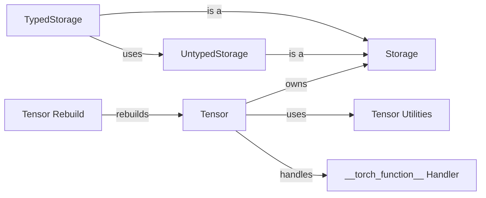

## Component Details

This component encompasses the fundamental data structure, `torch.Tensor`, and its associated operations. It manages memory allocation, data type conversions, and basic arithmetic and manipulation functions. It forms the bedrock upon which all other components are built, providing the essential building blocks for numerical computation in PyTorch. The core flow involves creating, manipulating, and storing tensors, with utilities for device management and data type conversions. Special handling is provided for custom tensor operations via the `__torch_function__` protocol, and for serialization/deserialization.

### Tensor
The central class representing a multi-dimensional array of numerical values. It provides methods for various operations, including arithmetic, linear algebra, and tensor manipulation. It also handles device placement (CPU, GPU) and memory management.
- **Related Classes/Methods**: `pytorch.torch._tensor.Tensor`

### Storage
Abstracts the underlying memory buffer for tensors. It provides methods for memory allocation, deallocation, and data access. It also handles device-specific memory management. `TypedStorage` and `UntypedStorage` are concrete implementations.
- **Related Classes/Methods**: `pytorch.torch.storage._StorageBase`, `pytorch.torch.storage.TypedStorage`, `pytorch.torch.storage.UntypedStorage`

### Tensor Utilities
A module containing utility functions for tensor manipulation, device management, and data type conversion. It provides helper functions for creating tensors from various data sources, moving tensors between devices, and converting between different data types.
- **Related Classes/Methods**: `pytorch.torch._utils`

### __torch_function__ Handler
Handles the `__torch_function__` protocol, allowing custom implementations of tensor operations. It intercepts calls to PyTorch functions and methods, and dispatches them to user-defined implementations if available.
- **Related Classes/Methods**: `pytorch.torch._tensor._handle_torch_function_and_wrap_type_error_to_not_implemented`

### Tensor Rebuild
Rebuilds a tensor from its type, storage, and other metadata. This function is used during unpickling to reconstruct a tensor from its serialized representation.
- **Related Classes/Methods**: `pytorch.torch._tensor._rebuild_from_type_v2`, `pytorch.torch._utils._rebuild_tensor`
