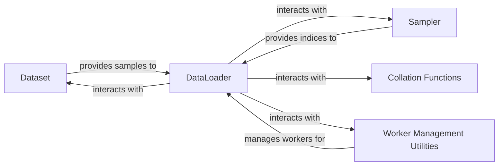

## Details

The `Data Utilities` subsystem is encapsulated within `torch.utils.data`. Its primary responsibility is to provide efficient and flexible mechanisms for loading, preprocessing, and batching data for machine learning models, abstracting away the complexities of data access and preparation from the training loop.

### Dataset
Defines the fundamental interface for data sources. `Dataset` is for map-style datasets (accessed by key/index via `__getitem__`), while `IterableDataset` is for iterable-style datasets (streamed via `__iter__`). These are crucial for abstracting various data storage and access patterns.

**Related Classes/Methods**:

- <a href="https://github.com/pytorch/pytorch/blob/main/torch/utils/data/dataset.py" target="_blank" rel="noopener noreferrer">`torch.utils.data.dataset.Dataset`</a>
- <a href="https://github.com/pytorch/pytorch/blob/main/torch/utils/data/dataset.py#L73-L183" target="_blank" rel="noopener noreferrer">`torch.utils.data.dataset.IterableDataset`:73-183</a>

### DataLoader
The central component responsible for iterating over a `Dataset`, handling batching, shuffling, and parallel data loading (multiprocessing). It provides a high-level API for feeding data into training loops.

**Related Classes/Methods**:

- <a href="https://github.com/pytorch/pytorch/blob/main/torch/utils/data/dataloader.py#L136-L631" target="_blank" rel="noopener noreferrer">`torch.utils.data.dataloader.DataLoader`:136-631</a>

### Sampler
Defines the strategy for drawing samples or batches of indices from a `Dataset`. Examples include `SequentialSampler`, `RandomSampler`, and `BatchSampler`. This component decouples the data access logic from the iteration order.

**Related Classes/Methods**:

- <a href="https://github.com/pytorch/pytorch/blob/main/torch/utils/data/sampler.py" target="_blank" rel="noopener noreferrer">`torch.utils.data.sampler.Sampler`</a>
- <a href="https://github.com/pytorch/pytorch/blob/main/torch/utils/data/sampler.py#L299-L367" target="_blank" rel="noopener noreferrer">`torch.utils.data.sampler.BatchSampler`:299-367</a>

### Collation Functions
Functions that merge a list of individual data samples (fetched from a `Dataset`) into a mini-batch, typically converting them into tensors and stacking them. `default_collate` is a common implementation.

**Related Classes/Methods**:

- <a href="https://github.com/pytorch/pytorch/blob/main/torch/utils/data/_utils/collate.py#L337-L398" target="_blank" rel="noopener noreferrer">`torch.utils.data._utils.collate.default_collate`:337-398</a>

### Worker Management Utilities
A set of internal modules within `_utils` that handle the complexities of multiprocessing for data loading. This includes creating and managing worker processes, inter-process communication (queues), and fetching data from workers.

**Related Classes/Methods**:

- <a href="https://github.com/pytorch/pytorch/blob/main/torch/utils/data/_utils/worker.py" target="_blank" rel="noopener noreferrer">`torch.utils.data._utils.worker`</a>
- <a href="https://github.com/pytorch/pytorch/blob/main/torch/utils/data/_utils/fetch.py" target="_blank" rel="noopener noreferrer">`torch.utils.data._utils.fetch`</a>

### [FAQ](https://github.com/CodeBoarding/GeneratedOnBoardings/tree/main?tab=readme-ov-file#faq)