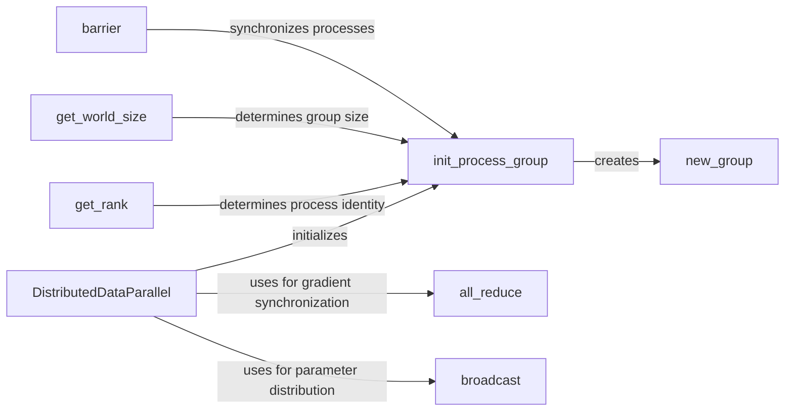

## Component Details

The `torch.distributed` package provides the necessary tools for distributed training in PyTorch. It handles the initialization of distributed processes, data parallelism, gradient synchronization, and communication between different processes or machines. The core components facilitate efficient and scalable training of deep learning models by leveraging multiple devices.

### init_process_group
Initializes the distributed environment by setting up the communication backend and establishing connections between processes. It's a fundamental step before any distributed communication can occur, defining how processes will interact.
- **Related Classes/Methods**: `pytorch.torch.distributed.distributed_c10d:init_process_group`

### DistributedDataParallel
Wraps a model to enable distributed data parallel training. It automatically splits the data across multiple processes and synchronizes gradients during the backward pass, simplifying the process of training models in parallel.
- **Related Classes/Methods**: `pytorch.torch.nn.parallel.distributed.DistributedDataParallel:__init__`, `pytorch.torch.nn.parallel.distributed.DistributedDataParallel:forward`

### all_reduce
Performs an all-reduce operation on a tensor across all processes in a group. This is commonly used for gradient synchronization, where gradients computed on different processes are averaged to update the model parameters.
- **Related Classes/Methods**: `pytorch.torch.distributed.distributed_c10d:all_reduce`

### broadcast
Broadcasts a tensor from one process to all other processes in the group. This is useful for distributing model parameters or data to all participating processes.
- **Related Classes/Methods**: `pytorch.torch.distributed.distributed_c10d:broadcast`

### new_group
Creates a new process group, enabling communication within a subset of processes. This allows for more complex communication patterns where not all processes need to communicate with each other.
- **Related Classes/Methods**: `pytorch.torch.distributed.distributed_c10d:new_group`

### get_rank
Returns the rank (ID) of the current process within the process group. This allows processes to identify themselves and perform different tasks based on their rank.
- **Related Classes/Methods**: `pytorch.torch.distributed.distributed_c10d:get_rank`

### get_world_size
Returns the total number of processes in the process group. This allows processes to determine the size of the distributed environment and adjust their behavior accordingly.
- **Related Classes/Methods**: `pytorch.torch.distributed.distributed_c10d:get_world_size`

### barrier
Synchronizes all processes in the process group. It blocks until all processes have reached the barrier, ensuring that all processes are at the same stage of execution.
- **Related Classes/Methods**: `pytorch.torch.distributed.distributed_c10d:barrier`
